## Tuần 10 - Secure & Operate: RBAC, Admission, Secrets, Supply Chain

Evidence pack này ghi nhận kết quả thực hiện các bài lab Tuần 10 về RBAC, chính sách admission, quản lý secret, bảo mật chuỗi cung ứng (supply chain) và phần challenge cô lập đa tenant đã được điều chỉnh phù hợp với trạng thái của repository `minikube-aws-sandbox`.

- `pdf/w10_morning_rbac_admission.html` - Buổi sáng: RBAC và Chính sách Admission.
- `pdf/w10_afternoon_secrets_supply_chain.html` - Buổi chiều: Secrets, Chuỗi cung ứng, Tích hợp nền tảng và Challenge.

Repository thực hành: `minikube-aws-sandbox`.

Môi trường triển khai:

- AWS EC2 chạy Docker và minikube.
- Terraform quản lý hạ tầng EC2, security group, quyền IAM và xuất bản kubeconfig.
- Argo CD quản lý tài nguyên Kubernetes từ Git thông qua `argocd/bootstrap/apps-applicationset.yaml`.
- Gatekeeper, External Secrets Operator, Sigstore policy-controller và Calico thực thi các kiểm soát bảo mật của Tuần 10.

## Table of Contents

1. [Tổng quan kết quả](#1-tổng-quan-kết-quả)
2. [Kiến trúc nền tảng hiện tại](#2-kiến-trúc-nền-tảng-hiện-tại)
3. [Phần I - Lab buổi sáng: RBAC và Chính sách Admission](#3-phần-i---lab-buổi-sáng-rbac-và-chính-sách-admission)
4. [Phần II - Lab buổi chiều: Secrets và Chuỗi cung ứng](#4-phần-ii---lab-buổi-chiều-secrets-và-chuỗi-cung-ứng)
5. [Phần III - Challenge: Cô lập tenant đã điều chỉnh](#5-phần-iii---challenge-cô-lập-tenant-đã-điều-chỉnh)
6. [Kết luận](#6-kết-luận)

## 1. Tổng quan kết quả

| Nhóm yêu cầu | Trạng thái minh chứng |
|---|---|
| Vai trò RBAC | Đã triển khai thông qua GitOps sử dụng `argocd/apps/rbac` và `argocd/apps/team-rbac`. |
| Xác minh RBAC | Đã xác minh bằng các lệnh kiểm tra giả lập `kubectl auth can-i`. |
| Chính sách admission Gatekeeper | Đã triển khai với Gatekeeper operator và các constraint trong thư mục `argocd/apps/gatekeeper-policies`. |
| Các guardrail manifest bắt buộc | Thực thi các quy tắc bắt buộc nhãn, registry được phép, chặn tag `:latest`, bắt buộc giới hạn tài nguyên, chặn user root và chặn `hostNetwork`. |
| External Secrets Operator | ESO được cài đặt trong quá trình bootstrap Argo CD và các manifest `ExternalSecret` đã hoạt động. |
| Mục tiêu xoay vòng secret | Một phần: secret Redis hiện tại sử dụng `refreshInterval: "1h"` và được tiêu thụ qua biến môi trường/đối số, do đó chưa chứng minh được khả năng xoay vòng dưới 60 giây mà không cần restart pod. |
| Quét Trivy | Một phần: Quét Trivy chạy trong CI và upload artifact, nhưng cấu hình `exit-code: "0"` hiện tại khiến các phát hiện chỉ dừng lại ở mức báo cáo/ghi nhận. |
| Ký ảnh bằng Cosign | Đã triển khai trong CI sử dụng Cosign và các thông tin ký được lưu trữ trong AWS Secrets Manager. |
| Xác minh chữ ký tại admission | Đã triển khai qua Sigstore policy-controller và `ClusterImagePolicy`. |
| Tenant cho challenge | Đã triển khai dưới dạng tenant `demo-development` được điều chỉnh thay vì dùng tên tenant `payments` như trong slide. |
| Quota và LimitRange cho challenge | Đã triển khai: các cấu hình `ResourceQuota` và `LimitRange` đã được định nghĩa trong ứng dụng `tenant-namespaces`. |
| Cô lập mạng cho challenge | Đã triển khai với minikube kích hoạt Calico và các manifest `NetworkPolicy`. |

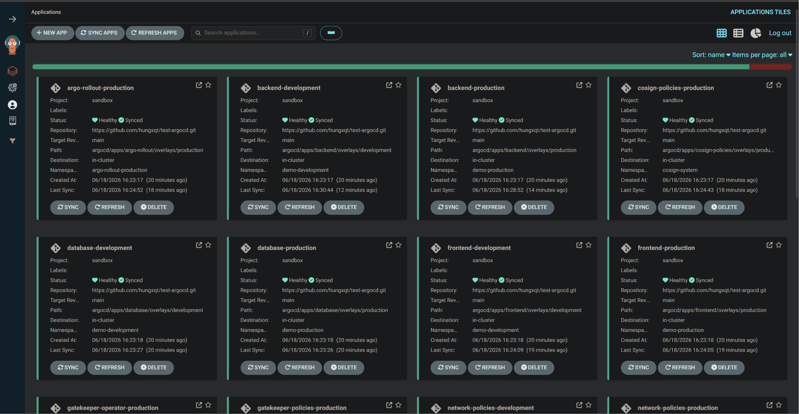

*Hình 01: Argo CD quản lý các ứng dụng nền tảng Week 10 từ Git.*

## 2. Kiến trúc nền tảng hiện tại

Hệ thống chạy trên một instance AWS EC2 được khởi tạo bằng Terraform. Dữ liệu user-data của EC2 khởi động minikube với Docker và Calico, xuất bản kubeconfig lên AWS Systems Manager Parameter Store và expose các port phục vụ cho bài lab.

Lớp ứng dụng Kubernetes được quản lý bởi Argo CD. Thành phần bootstrap quan trọng là `argocd/bootstrap/apps-applicationset.yaml`; nó quét thư mục `argocd/apps/*/overlays/*` và tạo ra một `Application` Argo CD tương ứng cho mỗi overlay. Điều này giúp cả hai overlay `production` và `development` tự động trở thành các ứng dụng được quản lý theo mô hình GitOps.

Các namespace hoạt động của tenant bao gồm:

| Namespace | Mục đích | Nhãn bảo mật |
|---|---|---|
| `demo-production` | Namespace dành cho ứng dụng production hiện tại. | `platform.xbrain.dev/security-profile=demo-restricted`, `policy.sigstore.dev/include=true` |
| `demo-development` | Namespace dành cho tenant development (challenge đã điều chỉnh). | `platform.xbrain.dev/security-profile=demo-restricted`, `policy.sigstore.dev/include=true` |

### 2.1. Ngữ cảnh hạ tầng

| File / Thư mục | Vai trò trong minh chứng Tuần 10 |
|---|---|
| `infra/templates/minikube-user-data.sh.tftpl` | Khởi động minikube với `--cni=calico`, bắt buộc để thực thi NetworkPolicy. |
| `infra/security.tf` | Mở các port cần thiết của operator và ứng dụng để truy cập lab. |
| `infra/iam.tf` | Cấp các quyền IAM hẹp cho EC2, bao gồm quyền đọc secrets phục vụ luồng Cosign và ESO. |
| `infra/outputs.tf` | Expose các URL, IP public và SSM parameter chứa kubeconfig dùng trong các lệnh kiểm tra. |

### 2.2. Ngữ cảnh GitOps

| File / Thư mục | Vai trò trong minh chứng Tuần 10 |
|---|---|
| `argocd/bootstrap/apps-applicationset.yaml` | Tự động phát hiện các overlay ứng dụng, phân bổ sync wave và namespace đích. |
| `argocd/apps/rbac` | Định nghĩa các quyền RBAC mức cluster cho developer/SRE/viewer từ lab buổi sáng. |
| `argocd/apps/team-rbac` | Định nghĩa các quyền truy cập developer trong phạm vi từng namespace của tenant. |
| `argocd/apps/gatekeeper-operator` | Cài đặt OPA Gatekeeper. |
| `argocd/apps/gatekeeper-policies` | Định nghĩa các constraint (chính sách admission). |
| `argocd/apps/database` | Định nghĩa Redis và `ExternalSecret` để đồng bộ thông tin đăng nhập. |
| `argocd/apps/policy-controller` | Cài đặt Sigstore policy-controller. |
| `argocd/apps/cosign-policies` | Định nghĩa các đối tượng `ClusterImagePolicy` để thực thi xác minh chữ ký khi admission. |
| `argocd/apps/network-policies` | Định nghĩa cô lập lưu lượng mạng egress cho các tenant. |
| `argocd/apps/tenant-namespaces` | Quản lý các đối tượng Namespace của tenant và các nhãn bảo mật đi kèm. |

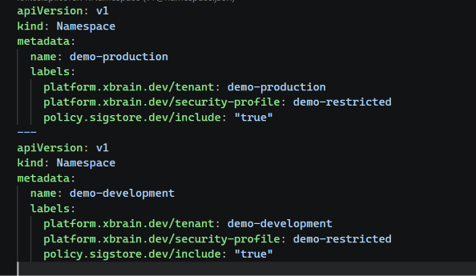

*Hình 02: Các namespace của tenant mang các nhãn kích hoạt chính sách bảo mật của Gatekeeper và Sigstore policy-controller.*

## 3. Phần I - Lab buổi sáng: RBAC và Chính sách Admission

### 3.1. Lab 1.1 - RBAC Qua GitOps

Lab buổi sáng yêu cầu tạo ba vai trò: developer, SRE và viewer. Trong repository này, việc cấu hình RBAC được chia tách giữa RBAC cấp cluster và team-RBAC cấp namespace của tenant.

| Vai trò trong slide | Định danh trong repo | Ranh giới phân quyền chính |
|---|---|---|
| Developer | `oidc:demo-developers` và các group developer cụ thể của tenant | Quản lý workload chỉ trong namespace được chỉ định. |
| SRE | `oidc:demo-sres` | Vận hành pod trên toàn cụm thông qua ClusterRole `demo-sre`. |
| Viewer | `oidc:demo-viewers` | Quyền đọc (read-only) đối với các tài nguyên workload và platform thông thường. |

Các file liên quan:

| File | Vai trò / Chi tiết |
|---|---|
| `argocd/apps/rbac/base/clusterroles.yaml` | Định nghĩa các ClusterRole cho SRE và viewer. |
| `argocd/apps/rbac/base/clusterrolebindings.yaml` | Các ClusterRoleBinding tương ứng cho SRE và viewer. |
| `argocd/apps/team-rbac/base/role.yaml` | Role developer của tenant được sử dụng bởi các overlay môi trường. |
| `argocd/apps/team-rbac/overlays/development/rolebinding.yaml` | Binding developer cho tenant development phục vụ challenge. |

Các lệnh xác minh RBAC:

```powershell
kubectl --kubeconfig generated\kubeconfig.yaml auth can-i create deployments -n demo-production --as=demo-developer --as-group=oidc:demo-developers
kubectl --kubeconfig generated\kubeconfig.yaml auth can-i create deployments -n kube-system --as=demo-developer --as-group=oidc:demo-developers
kubectl --kubeconfig generated\kubeconfig.yaml auth can-i get pods -A --as=demo-sre --as-group=oidc:demo-sres
kubectl --kubeconfig generated\kubeconfig.yaml auth can-i delete nodes --as=demo-viewer --as-group=oidc:demo-viewers
kubectl --kubeconfig generated\kubeconfig.yaml auth can-i get secrets -n demo-development --as=demo-development-developer --as-group=oidc:demo-development-developers
kubectl --kubeconfig generated\kubeconfig.yaml auth can-i create rolebindings -n demo-development --as=demo-development-developer --as-group=oidc:demo-development-developers
```

Kết quả xác minh mong đợi:

| Lệnh kiểm tra | Kết quả mong đợi |
|---|---|
| Developer tạo workload trong namespace được cấp | `yes` |
| Developer tạo workload trong `kube-system` | `no` |
| SRE đọc pod trên toàn bộ cụm | `yes` |
| Viewer xóa node | `no` |
| Developer của tenant development đọc secrets | `no` |
| Developer của tenant development tạo rolebindings | `no` |

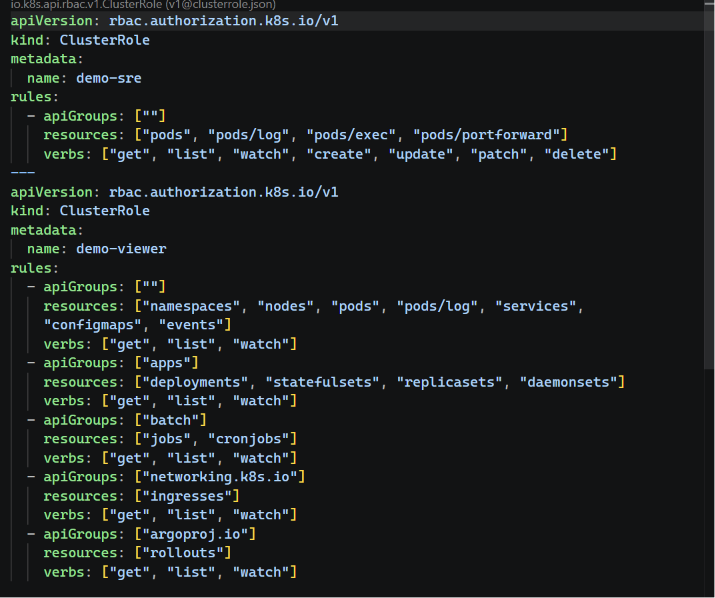

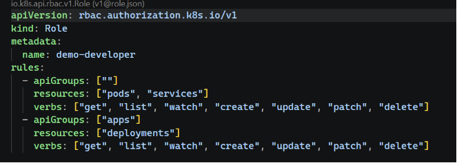

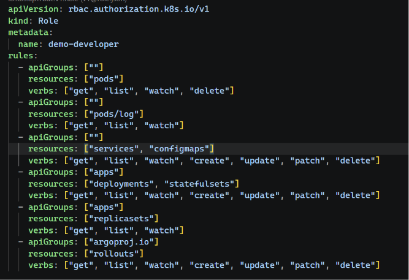

*Hình 03: Các manifest RBAC định nghĩa quyền hạn của developer, SRE, viewer và developer của tenant trong Git.*

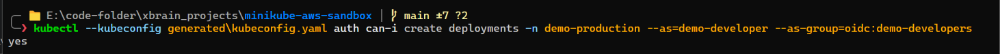

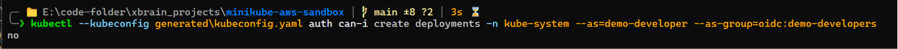

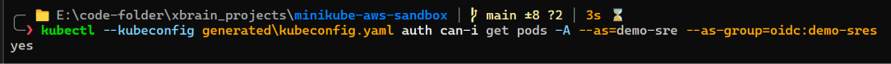

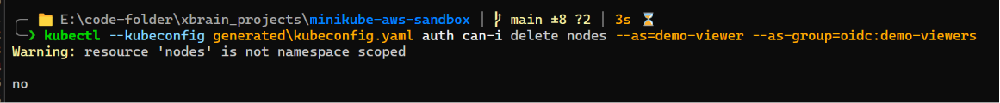

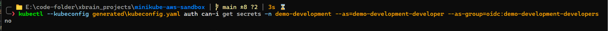

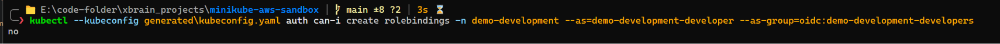

*Hình 04: Lệnh `kubectl auth can-i` xác minh các luồng phân quyền được cho phép và bị từ chối.*

### 3.2. Lab 1.2 - Chính sách Admission Gatekeeper

Lab buổi sáng yêu cầu triển khai các chính sách admission để từ chối các manifest không an toàn tại API server. Repository này cài đặt Gatekeeper và quản lý các constraint qua GitOps.

Các file liên quan:

| File / Thư mục | Vai trò / Chi tiết |
|---|---|
| `argocd/apps/gatekeeper-operator/overlays/production/Chart.yaml` | Khai báo dependency Helm chart Gatekeeper. |
| `argocd/apps/gatekeeper-operator/overlays/production/values.yaml` | Cấu hình tài nguyên Gatekeeper tối giản phù hợp minikube. |
| `argocd/apps/gatekeeper-policies/base` | Các file định nghĩa ConstraintTemplate và Constraint. |
| `argocd/apps/gatekeeper-policies/base/kustomization.yaml` | Liệt kê toàn bộ tài nguyên chính sách Gatekeeper được áp dụng qua GitOps. |

Các constraint đã triển khai:

| Constraint | Mục đích |
|---|---|
| `pods-must-have-app-label` | Bắt buộc pod phải có nhãn `app`. |
| `pods-must-use-allowed-registries` | Chỉ cho phép kéo ảnh từ registry được duyệt. |
| `pods-must-not-use-latest-tag` | Từ chối các ảnh sử dụng tag `:latest`. |
| `pods-must-have-resource-limits` | Bắt buộc container phải khai báo giới hạn tài nguyên (limits). |
| `pods-must-not-run-as-root-user` | Từ chối pod chạy dưới quyền root (`runAsUser: 0`). |
| `pods-must-not-use-host-network` | Từ chối pod cấu hình `hostNetwork: true`. |

Các lệnh kiểm tra trạng thái Gatekeeper:

```powershell
kubectl --kubeconfig generated\kubeconfig.yaml get pods -n gatekeeper-production
kubectl --kubeconfig generated\kubeconfig.yaml get constrainttemplates
# Xem danh sách constraints
kubectl --kubeconfig generated\kubeconfig.yaml get constraint
```

Kiểm thử dry-run phía server:

```powershell
kubectl --kubeconfig generated\kubeconfig.yaml -n demo-production run bad-latest --image=docker.io/library/nginx:latest --restart=Never --dry-run=server
kubectl --kubeconfig generated\kubeconfig.yaml -n demo-production run bad-no-limits --image=docker.io/library/nginx:1.27 --restart=Never --dry-run=server
```

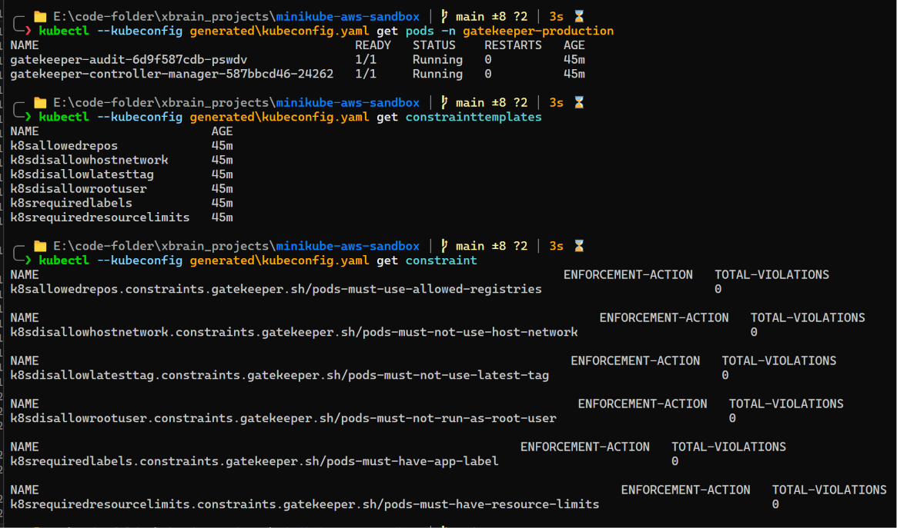

*Hình 05: Gatekeeper và các constraint đi kèm được quản lý trực quan bởi Argo CD.*

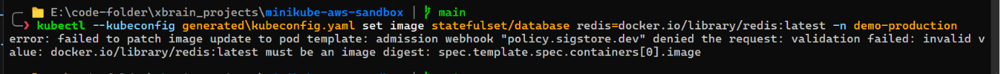

*Hình 06: Admission từ chối pod sử dụng ảnh mang tag `:latest`.*

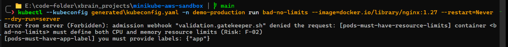

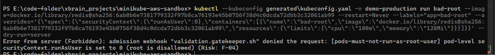

*Hình 07: Admission từ chối pod vi phạm quy tắc thiếu limits, chạy root user hoặc hostNetwork.*

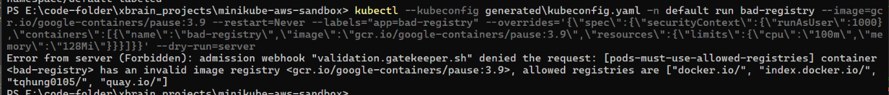

*Hình 08: Minh chứng về chính sách nhãn bắt buộc hoặc registry được phép đáp ứng yêu cầu custom policy.*

## 4. Phần II - Lab buổi chiều: Secrets và Chuỗi cung ứng

### 4.1. Lab 2.1 - External Secrets Operator

Lab buổi chiều yêu cầu sử dụng AWS Secrets Manager và External Secrets Operator để đồng bộ hóa Kubernetes Secret từ AWS thay vì lưu trữ trực tiếp các giá trị nhạy cảm trên Git.

Các file liên quan:

| File | Vai trò / Chi tiết |
|---|---|
| `argocd/install.ps1` | Cài đặt External Secrets Operator trước khi áp dụng thông tin đăng nhập repo cho Argo CD. |
| `argocd/install/clustersecretstore.yaml` | Định nghĩa `ClusterSecretStore` tên `aws-secretsmanager`. |
| `argocd/apps/database/base/externalsecret.yaml` | Đồng bộ mật khẩu Redis từ AWS Secrets Manager vào trong Kubernetes. |
| `scripts/upload-secrets-to-aws.ps1` | Script tải các secrets của bài lab lên AWS Secrets Manager. |

Lưu ý trạng thái triển khai:

Đối tượng `ExternalSecret` của Redis hiện tại sử dụng cấu hình `refreshInterval: "1h"`. Container Redis tiêu thụ mật khẩu `REDIS_PASSWORD` thông qua biến môi trường và đối số câu lệnh khởi động. Điều này chứng minh ESO hoạt động tốt, nhưng chưa chứng minh được khả năng xoay vòng dưới 60 giây mà không cần restart pod. Yêu cầu này được đánh dấu ở trạng thái một phần do kiến trúc tiêu thụ qua biến môi trường bắt buộc pod phải restart để nhận mật khẩu mới.

Các lệnh kiểm tra ESO:

```powershell
kubectl --kubeconfig generated\kubeconfig.yaml get pods -n external-secrets
kubectl --kubeconfig generated\kubeconfig.yaml get clustersecretstore aws-secretsmanager
kubectl --kubeconfig generated\kubeconfig.yaml -n demo-production get externalsecret redis-credentials
kubectl --kubeconfig generated\kubeconfig.yaml -n demo-production get secret redis-credentials
kubectl --kubeconfig generated\kubeconfig.yaml -n demo-production get pod -l app=database
```

Quét rò rỉ secret trong code:

```powershell
rg -n "prod@123|password:|secretAccessKey|AWS_SECRET_ACCESS_KEY|COSIGN_PASSWORD|DOCKERHUB_TOKEN" .
```

Kết quả xác minh mong đợi:

| Lệnh kiểm tra | Kết quả mong đợi |
|---|---|
| ESO pods | Ở trạng thái `Running` trong namespace `external-secrets`. |
| `ClusterSecretStore` | Tồn tại và kết nối thành công tới AWS Secrets Manager. |
| Redis `ExternalSecret` | Trạng thái `Ready` trong namespace `demo-production`. |
| Kubernetes Secret | Được sinh ra tự động và chứa mật khẩu đã được mã hóa Base64. |
| Quét rò rỉ secret | Không tìm thấy bất kỳ mật khẩu thật nào bị commit trên Git. |

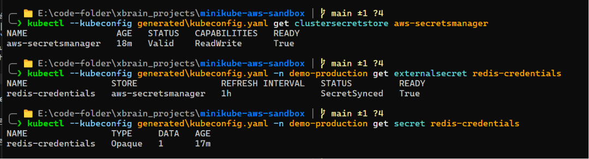

*Hình 09: External Secrets Operator đồng bộ hóa các giá trị từ AWS Secrets Manager thành Kubernetes Secret.*

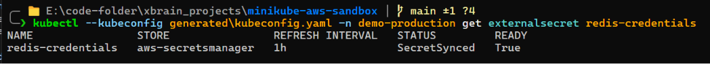

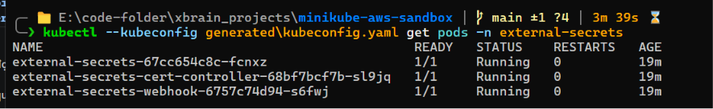

*Hình 10: Minh chứng đồng bộ secret và thời gian sống của pod. Cần lưu ý trạng thái một phần đối với yêu cầu xoay vòng mật khẩu < 60s không cần restart pod.*

### 4.2. Lab 2.2 - Trivy, Cosign và Xác minh tại Admission

Lab bảo mật chuỗi cung ứng yêu cầu ba chốt kiểm soát: quét ảnh, ký ảnh và xác minh chữ ký trước khi cho phép deploy vào cụm.

Các file liên quan:

| File / Thư mục | Vai trò / Chi tiết |
|---|---|
| `.github/workflows/ci.yaml` | Build ảnh, chạy Trivy, push digest, thực hiện ký và kiểm tra chữ ký. |
| `argocd/security/cosign.pub` | Public key dùng để Cosign xác minh và policy-controller đối chiếu chữ ký. |
| `scripts/upload-secrets-to-aws.ps1` | Tải `minikube-sandbox/cosign-key` and `minikube-sandbox/cosign-password` lên AWS. |
| `argocd/apps/policy-controller` | Cài đặt Sigstore policy-controller. |
| `argocd/apps/cosign-policies/overlays/production/policy.yaml` | Ràng buộc ảnh frontend/backend phải được ký hợp lệ. |
| `argocd/apps/cosign-policies/overlays/production/redis-policy.yaml` | Cho phép ảnh Redis chính thức đi qua bằng quy tắc pass tĩnh. |

Lưu ý trạng thái triển khai:

Trivy hiện tại được cấu hình chạy ở chế độ chỉ ghi nhận báo cáo do sử dụng `exit-code: "0"` trong workflow. Các phát hiện lỗi bảo mật không làm dừng pipeline CI. Vì vậy, kiểm soát này được ghi nhận ở trạng thái một phần.

Các lệnh kiểm tra CI và chữ ký:

```powershell
git grep -n "trivy-action\\|cosign\\|ClusterImagePolicy\\|policy-controller" -- .github/workflows/ci.yaml argocd infra scripts
kubectl --kubeconfig generated\kubeconfig.yaml get pods -n cosign-system
kubectl --kubeconfig generated\kubeconfig.yaml get clusterimagepolicy
kubectl --kubeconfig generated\kubeconfig.yaml get ns demo-production demo-development --show-labels
```

Kết quả xác minh mong đợi:

| Lệnh kiểm tra | Kết quả mong đợi |
|---|---|
| Bước quét Trivy | Xuất hiện trong CI, chạy ở chế độ ghi nhận báo cáo (exit-code 0). |
| Bước ký bằng Cosign | Hoạt động sau khi push ảnh và ký lên digest cụ thể. |
| Bước verify bằng Cosign | Chạy thành công trong CI sử dụng key `argocd/security/cosign.pub`. |
| policy-controller | Ở trạng thái `Running` trong namespace `cosign-system`. |
| `ClusterImagePolicy` | Được khởi tạo thành công trong cụm. |
| Nhãn kích hoạt trên namespace | Đã gán nhãn `policy.sigstore.dev/include=true`. |

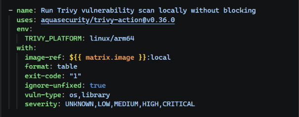

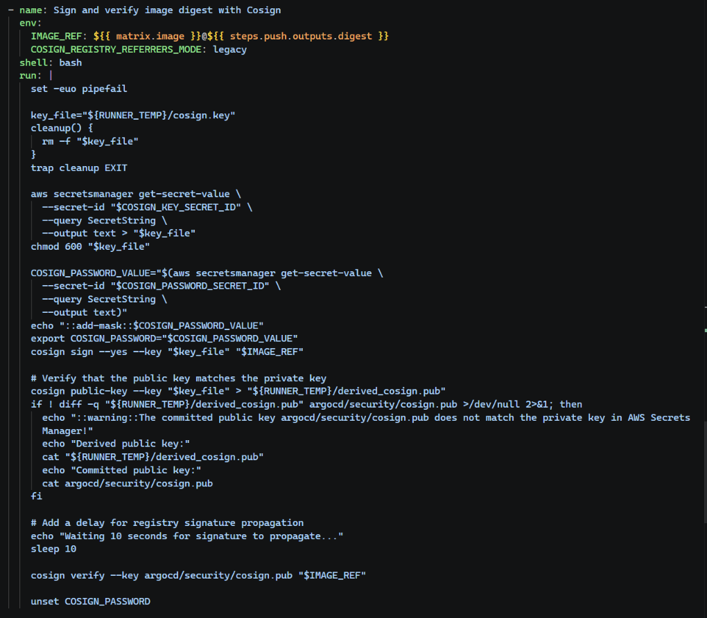

*Hình 11: GitHub Actions chạy quét Trivy và thực hiện ký/xác minh ảnh bằng Cosign khi phát hành.*

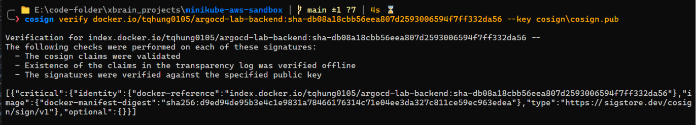

*Hình 12: Cosign xác minh chữ ký của digest ảnh sử dụng public key đã commit.*

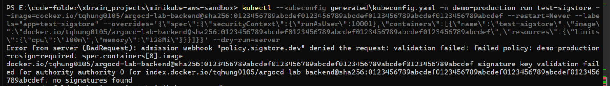

*Hình 13: Sigstore policy-controller thực hiện kiểm tra chữ ký tại thời điểm admission trên các namespace được chỉ định.*

## 5. Phần III - Challenge: Cô lập tenant đã điều chỉnh

Yêu cầu gốc của slide challenge đặt tên tenant mới là `payments`. Trong repository thực tế, challenge đã được điều chỉnh sử dụng `demo-development` làm tenant thứ hai. Toàn bộ minh chứng cô lập dưới đây được thể hiện dựa trên mô hình tenant thực tế này.

Bảng ánh xạ các yêu cầu challenge vào cụm:

| Yêu cầu trong slide | Trạng thái thực tế trong repo | Trạng thái |
|---|---|---|
| Namespace tenant mới | `demo-development` trong file namespaces.yaml | Đã triển khai |
| Quyền RBAC tối thiểu | RoleBinding giới hạn cho `oidc:demo-development-developers` | Đã triển khai |
| ResourceQuota và LimitRange | Đã định nghĩa các manifest `ResourceQuota` và `LimitRange` trong tenant-namespaces base | Đã triển khai |
| Cô lập bằng NetworkPolicy | Chặn egress chéo namespace + CNI Calico | Đã triển khai |
| Triển khai ứng dụng qua GitOps | ApplicationSet tự quét và sync `overlays/*` | Đã triển khai |
| Kế thừa các chính sách bảo mật | Nhãn Gatekeeper và Sigstore gán trên namespace mới | Đã triển khai |

### 5.1. Cô lập RBAC

Các lệnh kiểm tra cô lập RBAC:

```powershell
kubectl --kubeconfig generated\kubeconfig.yaml auth can-i update rollouts.argoproj.io -n demo-development --as=demo-development-developer --as-group=oidc:demo-development-developers
kubectl --kubeconfig generated\kubeconfig.yaml auth can-i get pods -n demo-development --as=demo-development-developer --as-group=oidc:demo-development-developers
kubectl --kubeconfig generated\kubeconfig.yaml auth can-i update rollouts.argoproj.io -n demo-production --as=demo-development-developer --as-group=oidc:demo-development-developers
kubectl --kubeconfig generated\kubeconfig.yaml auth can-i get secrets -n demo-development --as=demo-development-developer --as-group=oidc:demo-development-developers
kubectl --kubeconfig generated\kubeconfig.yaml auth can-i create rolebindings -n demo-development --as=demo-development-developer --as-group=oidc:demo-development-developers
kubectl --kubeconfig generated\kubeconfig.yaml auth can-i create clusterrolebindings --as=demo-development-developer --as-group=oidc:demo-development-developers
```

Kết quả cô lập mong đợi:

| Lệnh kiểm tra | Kết quả mong đợi |
|---|---|
| Quản lý workload trong `demo-development` | `yes` |
| Quản lý workload trong `demo-production` | `no` |
| Đọc secret trong namespace | `no` |
| Tạo rolebinding | `no` |
| Tạo clusterrolebinding | `no` |

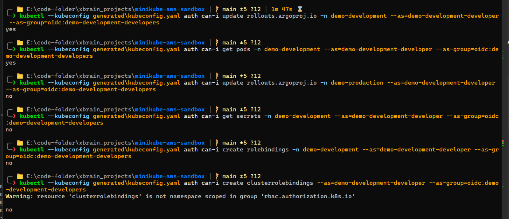

*Hình 14: Developer của tenant `demo-development` bị giới hạn trong namespace của mình, không có quyền đọc secret hay cấu hình RBAC.*

### 5.2. ResourceQuota và LimitRange

Slide challenge yêu cầu cấu hình một `ResourceQuota` và một `LimitRange` cho tenant mới. Các tài nguyên này hiện đã được định nghĩa trong file `quotas.yaml` của GitOps.

Các lệnh kiểm tra:

```powershell
git grep -n "ResourceQuota\|LimitRange" argocd
kubectl --kubeconfig generated\kubeconfig.yaml -n demo-development get resourcequota,limitrange
```

Kết quả mong đợi:

| Kiểm tra | Kết quả thực tế |
|---|---|
| Tìm kiếm manifest trong repo | Tìm thấy định nghĩa trong file `argocd/apps/tenant-namespaces/base/quotas.yaml`. |
| Truy vấn tài nguyên trên cụm | Tìm thấy `tenant-quota` và `tenant-limits` đang hoạt động trong namespace `demo-development`. |

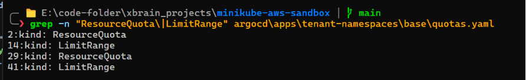

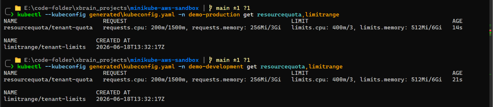

*Hình 15: Trạng thái ResourceQuota và LimitRange của tenant. Đã được triển khai thành công để áp giới hạn tài nguyên.*

### 5.3. NetworkPolicy và Kế thừa các Guardrail

Các lệnh kiểm tra NetworkPolicy:

```powershell
# Xem các pod Calico
kubectl --kubeconfig generated\kubeconfig.yaml get pods -n kube-system | Select-String -Pattern "calico"
# Xem NetworkPolicy trong namespace
kubectl --kubeconfig generated\kubeconfig.yaml -n demo-development get networkpolicy
# Test kết nối cùng namespace
kubectl --kubeconfig generated\kubeconfig.yaml -n demo-development run netcheck-dev --rm -i --restart=Never --image=curlimages/curl:8.11.1 -- sh -c "curl -fsS --max-time 5 http://backend:5000/healthz"
# Test chặn kết nối sang namespace production
kubectl --kubeconfig generated\kubeconfig.yaml -n demo-development run netcheck-dev-to-prod --rm -i --restart=Never --image=curlimages/curl:8.11.1 -- sh -c "curl -fsS --max-time 5 http://backend.demo-production.svc.cluster.local:5000/healthz"
```

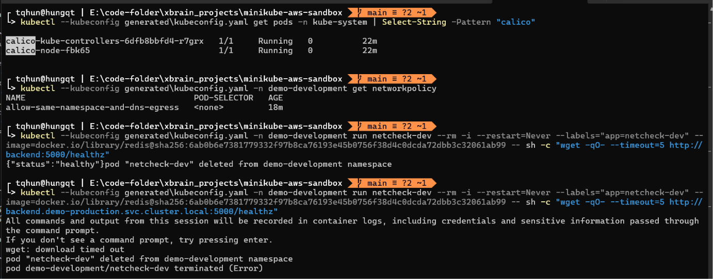

*Hình 16: Kết quả kết nối thực tế.*

Kết quả kết nối thực tế:

| Luồng kết nối | Kết quả thực tế |
|---|---|
| Trạng thái CNI Calico | Các pod Calico hoạt động tốt trong `kube-system`. |
| Kết nối nội bộ `demo-development` | `Allowed` (trả về HTTP 200). |
| Kết nối sang backend `demo-production` | `Blocked` (bị timeout hoàn toàn). |

Xác minh kế thừa guardrail:

```powershell
kubectl --kubeconfig generated\kubeconfig.yaml get ns demo-development --show-labels
kubectl --kubeconfig generated\kubeconfig.yaml -n demo-development run bad-latest --image=docker.io/library/nginx:latest --restart=Never --dry-run=server
kubectl --kubeconfig generated\kubeconfig.yaml get clusterimagepolicy
```

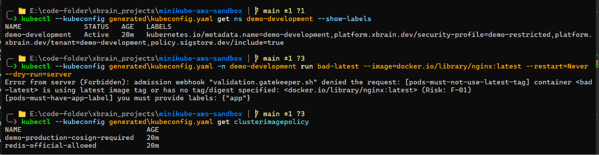

*Hình 17: Kế thừa guardrail.*

Kết quả:

- Namespace `demo-development` tự động mang các nhãn kích hoạt bảo mật.
- Cố gắng deploy ảnh tag `:latest` vào `demo-development` bị Gatekeeper chặn lại ngay lập tức.
- Yêu cầu ký ảnh Cosign tự động áp dụng khi triển khai.

## 6. Kết luận

Tuần 10 đã bổ sung các chốt kiểm soát bảo mật mức cụm lên trên nền tảng GitOps, observability và rollout của Tuần 9. RBAC giới hạn đối tượng thao tác, Gatekeeper chặn các manifest không an toàn, ESO loại bỏ hoàn toàn việc commit plaintext secret lên Git, Cosign ký các ảnh phát hành và policy-controller kiểm tra chữ ký hợp lệ tại thời điểm admission.

Challenge đã điều chỉnh sử dụng `demo-development` làm tenant thứ hai. Hệ thống đã thể hiện được tính đúng đắn về quyền sở hữu namespace, phân quyền RBAC hẹp, tự động kế thừa chính sách bảo mật qua nhãn và cô lập lưu lượng mạng bằng Calico NetworkPolicy. 
