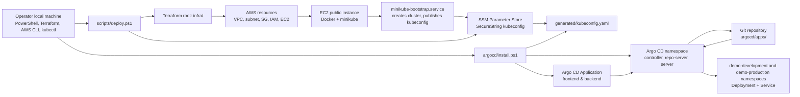
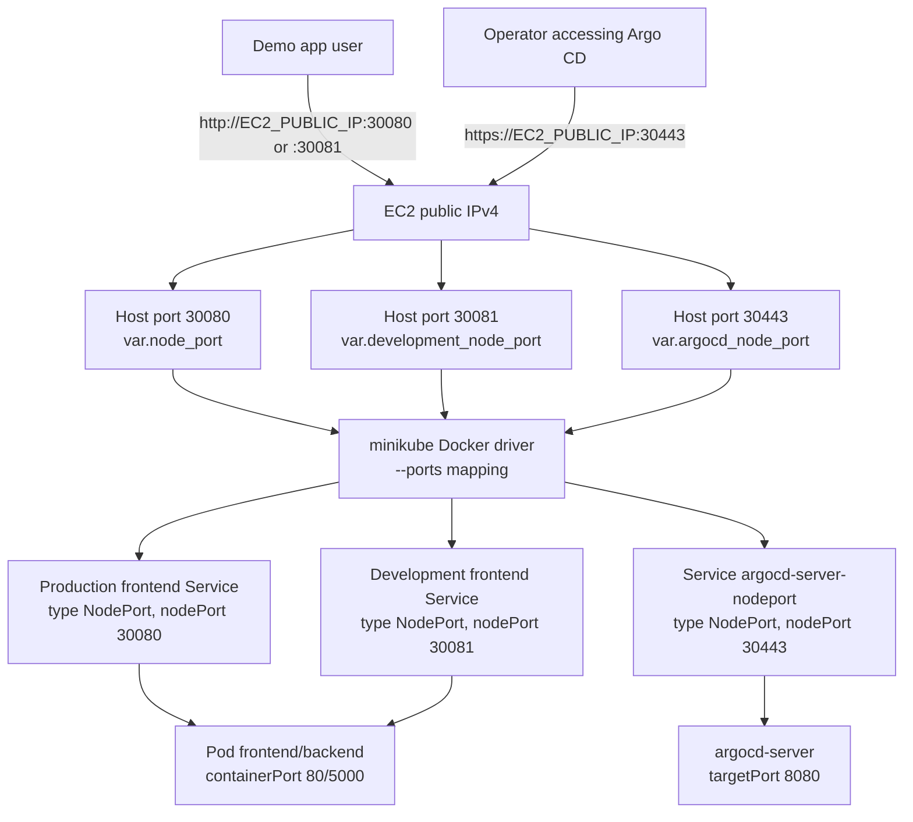
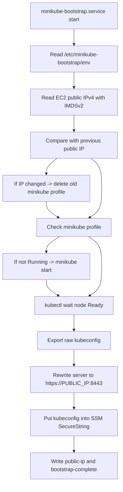
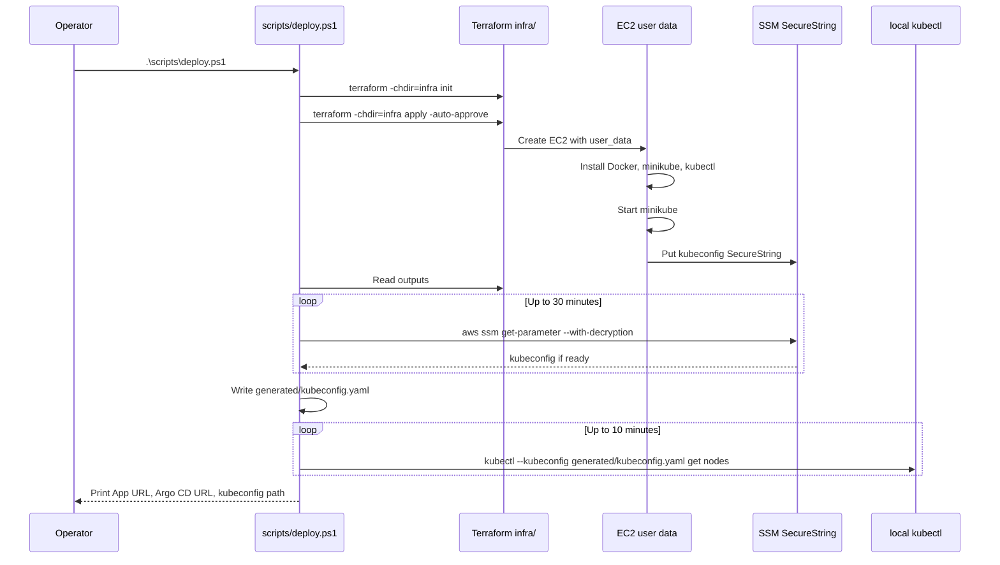
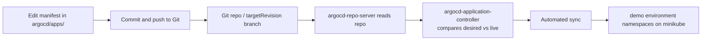

# HOW IT WORKS - Terraform AWS Minikube Sandbox

This document explains how this repository deploys infrastructure, how EC2 bootstraps minikube, how kubeconfig is brought back to the local machine, and especially how Argo CD takes over Kubernetes application delivery.

The most important points in the current architecture:

- Terraform only manages AWS infrastructure and minikube bootstrap.
- Argo CD manages Kubernetes application delivery.
- There is no longer an `app/` Terraform root.
- There are no Terraform-managed `demo` namespace, `Deployment`, or `Service` resources.
- There is no ALB, no Elastic IP, and no Kubernetes `LoadBalancer`.
- Traffic goes directly to the EC2 public IPv4 through NodePort.

## 1. Ownership Boundary

| Area | Managed by | Main files |
| --- | --- | --- |
| AWS infrastructure | Terraform | `infra/` |
| VPC and EC2 module wrappers | Terraform local modules | `modules/vpc/`, `modules/ec2-instance/` |
| EC2 bootstrap and minikube | EC2 user data + systemd | `infra/templates/minikube-user-data.sh.tftpl` |
| Fetch kubeconfig locally | PowerShell + AWS SSM | `scripts/deploy.ps1`, `scripts/fetch-kube-config.ps1` |
| Install Argo CD | kubectl + Kustomize | `argocd/install.ps1`, `argocd/install/` |
| Kubernetes app | Argo CD | `argocd/bootstrap/apps-applicationset.yaml`, `argocd/apps/*/base/`, `argocd/apps/*/overlays/` |
| Uninstall Argo CD | kubectl | `argocd/uninstall.ps1` |
| Destroy AWS infra | Terraform | `scripts/destroy.ps1` |

This boundary avoids making Terraform manage Kubernetes resources before the Kubernetes API exists. Terraform creates the remote minikube cluster first. After that, Argo CD is installed into the cluster and starts syncing the app from Git.

## 2. Overall Architecture Diagram



The flow has two separate phases:

1. `scripts/deploy.ps1` deploys AWS infra, waits for EC2 to bootstrap minikube, and downloads kubeconfig from SSM into `generated/kubeconfig.yaml`.
2. `argocd/install.ps1` uses that kubeconfig to install Argo CD and create the Argo CD `Application`.

This is why Argo CD is not part of the Terraform apply flow. Terraform does not need a Kubernetes provider to create the app. After the cluster exists, Argo CD becomes responsible for syncing Kubernetes resources.

## 3. Traffic Diagram

The current stack exposes both the app and Argo CD through NodePort on the EC2 public IP.



Main ports:

| Port | Terraform variable | Purpose | Security group CIDR |
| --- | --- | --- | --- |
| `8443` | `kubernetes_api_port` | minikube Kubernetes API | `allowed_kubernetes_api_cidr` or operator `/32` |
| `30080` | `node_port` | Production demo app NodePort | `allowed_app_cidr`, `allowed_http_cidr`, or operator `/32` |
| `30081` | `development_node_port` | Development demo app NodePort | `allowed_app_cidr`, `allowed_http_cidr`, or operator `/32` |
| `30443` | `argocd_node_port` | Argo CD UI/API NodePort | `allowed_argocd_cidr` or operator `/32` |

`allowed_kubernetes_api_cidr` and `allowed_argocd_cidr` are validated so they cannot be `0.0.0.0/0`. The app CIDR can be broader, but that should be intentional because it is a public NodePort on EC2.

## 4. How Terraform Deploys Infra

### 4.1. Terraform root `infra/`

`infra/versions.tf` sets the version floor:

- Terraform `>= 1.5.7, < 2.0`.
- AWS provider `>= 6.37, < 7.0`.
- HTTP provider `>= 3.5, < 4.0`.

`infra/main.tf` creates two modules:

- `module "vpc"` calls the local wrapper `../modules/vpc`.
- `module "minikube_host"` calls the local wrapper `../modules/ec2-instance`.

The local wrapper `modules/vpc` pins upstream `terraform-aws-modules/vpc/aws` version `6.6.1`.

The local wrapper `modules/ec2-instance` pins upstream `terraform-aws-modules/ec2-instance/aws` version `6.4.0`.

### 4.2. VPC

The VPC is configured as a low-cost sandbox:

- Default CIDR `10.40.0.0/16`.
- One public subnet.
- `map_public_ip_on_launch = true`.
- No NAT Gateway.
- No Elastic IP.
- No Application Load Balancer.
- No private app tier.

The EC2 host is placed in this public subnet and receives a dynamic public IPv4 from AWS.

### 4.3. EC2 minikube host

The EC2 instance is created by `module "minikube_host"` with these main settings:

- Default instance type `t4g.small`.
- AMI is Amazon Linux 2023, selected by instance type architecture.
- If the instance type is Graviton, such as `t4g.small`, the AMI architecture is `arm64`.
- Public IP is assigned directly, but no Elastic IP is created.
- Root EBS volume is `gp3`, encrypted, and defaults to 30 GiB.
- IMDSv2 is required with `http_tokens = "required"`.
- `instance_initiated_shutdown_behavior = "stop"`.
- `user_data_replace_on_change = true`.

`user_data_replace_on_change = true` means changes to the bootstrap template can cause Terraform to replace the EC2 instance. If the EC2 instance is replaced, the minikube cluster inside it is recreated.

### 4.4. Auto-detect operator CIDR

`infra/locals.tf` uses the HTTP provider to call:

```text
https://checkip.amazonaws.com
```

If `allowed_kubernetes_api_cidr = null`, Terraform reads the current public IPv4 of the machine running Terraform and turns it into a `/32`.

That CIDR is used for the Kubernetes API. The app and Argo CD can also inherit this CIDR if `allowed_app_cidr` or `allowed_argocd_cidr` is `null`.

This is safer by default than exposing the API to the whole internet. If your public IP changes, you need to apply infra again so the security group allows the new IP.

### 4.5. IAM and SSM kubeconfig

The EC2 instance has an IAM role with:

- `AmazonSSMManagedInstanceCore`, so the instance can work with AWS Systems Manager.
- Custom policy `aws_iam_policy.kubeconfig_writer`, allowing it to write exactly one SSM parameter containing kubeconfig.
- KMS encrypt permissions restricted through the SSM service in the same account.

Kubeconfig is stored in SSM Parameter Store as a `SecureString`. The local script downloads it with `aws ssm get-parameter --with-decryption` and writes it to:

```text
generated/kubeconfig.yaml
```

That file is git-ignored.

## 5. EC2 Bootstrap Minikube

The bootstrap template is:

```text
infra/templates/minikube-user-data.sh.tftpl
```

This is the most important custom infra component. Terraform renders this template into EC2 user data and passes values such as:

- AWS region.
- Kubernetes version.
- minikube version.
- kubectl version.
- Kubernetes API port.
- Production app NodePort.
- Development app NodePort.
- Argo CD NodePort.
- SSM parameter name for kubeconfig.

### 5.1. What user data does when EC2 boots

User data runs these steps:

1. `dnf update -y`.
2. Install `awscli-2`, `conntrack-tools`, and `docker`.
3. Enable and start Docker.
4. Create Linux user `minikube` if it does not already exist.
5. Add user `minikube` to the `docker` group.
6. Detect EC2 architecture: `arm64` or `amd64`.
7. Download the minikube binary for `minikube_version`.
8. Download the kubectl binary for `kubectl_version`.
9. Write `/etc/minikube-bootstrap/env`.
10. Create `/usr/local/sbin/minikube-bootstrap.sh`.
11. Create systemd unit `minikube-bootstrap.service`.
12. Enable and start the service.

### 5.2. `minikube-bootstrap.service`

This systemd service runs the real bootstrap and can run again after EC2 reboots.



Important details:

- The service reads public IPv4 with IMDSv2.
- If public IP changes after stop/start, the service deletes the old minikube profile and recreates it. This is required because the Kubernetes API certificate must include the new public IP.
- `minikube start` uses the Docker driver and container runtime `containerd`.
- minikube listens on `0.0.0.0`.
- The API server uses port `8443`.
- `--apiserver-ips="$PUBLIC_IPV4"` adds the public IP to the certificate SAN.
- `--ports` maps four ports from the minikube Docker container to the EC2 host:
  - `8443:8443` for the Kubernetes API.
  - `30443:30443` for Argo CD.
  - `30080:30080` for the production demo app.
  - `30081:30081` for the development demo app.
- Raw kubeconfig is rewritten so `server:` points to `https://PUBLIC_IPV4:8443`.
- The public kubeconfig is published to SSM as a `SecureString`.

Bootstrap logs:

```text
/var/log/minikube-user-data.log
/var/log/minikube-bootstrap.log
```

## 6. What `scripts/deploy.ps1` Does

Deploy command:

```powershell
.\scripts\deploy.ps1
```

This script does not install Argo CD. It only deploys AWS infra, waits for minikube to become ready, and fetches kubeconfig locally.



After `deploy.ps1` succeeds:

- AWS infra has been created.
- EC2 is running minikube.
- The Kubernetes API is reachable from the local machine through `generated/kubeconfig.yaml`.
- Terraform outputs include `development_app_url`, `production_app_url`, and `argocd_url`.
- Argo CD and the app do not necessarily exist yet. They are created by the `argocd/install.ps1` phase.

## 7. Argo CD Is The Center Of App Delivery

The `argocd/` directory contains:

```text
argocd/
|-- install/                 # Argo CD installation overlay
|-- bootstrap/               # Argo CD ApplicationSet bootstrap resource
|-- apps/                    # Wrappers & applications synced by Argo CD
|-- install.ps1              # Installs Argo CD and applies the ApplicationSet
`-- uninstall.ps1            # Removes Argo CD from the remote cluster
```

### 7.1. Argo CD install overlay

`argocd/install/kustomization.yaml` includes:

```text
argocd/install/namespace.yaml
https://raw.githubusercontent.com/argoproj/argo-cd/v3.4.3/manifests/install.yaml
argocd/install/argocd-server-nodeport.yaml
```

The project does not rewrite the entire Argo CD manifest. It uses the upstream Argo CD install manifest version `v3.4.3`, then adds two local pieces:

- Namespace `argocd`.
- Service `argocd-server-nodeport`.

`argocd-server-nodeport.yaml` is a custom Service that exposes Argo CD UI/API:

- Name: `argocd-server-nodeport`.
- Namespace: `argocd`.
- Type: `NodePort`.
- Service port: `443`.
- Target port: `8080`.
- NodePort: `30443`.
- Selector: `app.kubernetes.io/name: argocd-server`.

Because the EC2 security group opens port `30443` and minikube bootstrap maps port `30443`, you can access Argo CD at:

```text
https://EC2_PUBLIC_IP:30443/
```

Argo CD server uses a self-signed certificate, so the browser may show a TLS warning.

### 7.2. `argocd/install.ps1`

Install Argo CD:

```powershell
.\argocd\install.ps1 `
  -RepoUrl "https://github.com/*/test-argocd.git" `
  -TargetRevision "main"
```

The script does these steps:

1. Use the default kubeconfig `generated\kubeconfig.yaml`, unless `-KubeconfigPath` is passed.
2. If `-RepoUrl` is not passed, try to read the workspace Git remote.
3. Apply the Argo CD install overlay with server-side apply:

```powershell
kubectl --kubeconfig generated\kubeconfig.yaml apply `
  --server-side=true `
  --force-conflicts `
  --field-manager=argocd-installer `
  -k argocd/install
```

Server-side apply is important here. Argo CD CRDs, especially `applicationsets.argoproj.io`, have very large annotations. If you use normal client-side apply, you may hit this error:

```text
metadata.annotations: Too long: may not be more than 262144 bytes
```

4. Wait for the three Argo CD CRDs to be Established:
   - `applications.argoproj.io`
   - `appprojects.argoproj.io`
   - `applicationsets.argoproj.io`
5. Wait for all deployments in namespace `argocd` to become Available.
6. Wait for StatefulSet `argocd-application-controller` rollout to finish.
7. Render `argocd/bootstrap/apps-applicationset.yaml`, replace repo URL and target revision from script parameters, then apply the Argo CD `ApplicationSet` resource.
8. Print Argo CD URL and demo app URL from Terraform outputs if available.

### 7.3. Argo CD ApplicationSet

`argocd/bootstrap/apps-applicationset.yaml` declares an Argo CD `ApplicationSet` named `sandbox-apps` that uses a Git generator to dynamically discover and manage individual application environments.

It targets:
- Paths matching `argocd/apps/*/overlays/*` (e.g. `argocd/apps/backend/overlays/production` and `argocd/apps/backend/overlays/production`).

For each matching environment, it dynamically generates an `Application` resource with the following settings:

| Setting | Value / Behavior |
| --- | --- |
| **Project** | `sandbox` (a custom `AppProject` defined in the same bootstrap manifest). |
| **Source path** | The path discovered by the generator (e.g., `argocd/apps/backend/overlays/production`). |
| **Destination namespace** | The environment-specific namespace (e.g., `demo-development` or `demo-production`). |
| **Automated Pruning** | `prune = true` (resources removed from Git are deleted from the cluster). |
| **Self Healing** | `selfHeal = true` (manual cluster changes are overridden by Git state). |
| **Create Namespace** | `CreateNamespace = true` (creates target namespaces if they do not exist). |

After Argo CD is installed, you do not need Terraform to update the app. To change the app, edit manifests under `argocd/apps/`, push to Git, and let Argo CD reconcile.

### 7.4. Demo app manifests

Each individual workload application under `argocd/apps/` (such as `frontend/`, `backend/`, and `database/`) contains:

```text
base/
overlays/development/
overlays/production/
kustomization.yaml
```

The base configuration contains the core workload resources (e.g., `Deployment`, `Service`, or `StatefulSet`).

The overlays add environment-specific namespaces and replica counts:

- Development: namespace `demo-development`, `2` replicas, external `NodePort` Service on `30081`.
- Production: namespace `demo-production`, `5` replicas, external `NodePort` Service on `30080`.

The shared deployment runs unprivileged nginx:

- Image: `nginxinc/nginx-unprivileged:1.29-alpine`.
- Container port: `8080`.
- Small resource requests/limits for the sandbox.
- Liveness and readiness probes on `/`.
- Pod `securityContext`:
  - `runAsNonRoot: true`.
  - `seccompProfile: RuntimeDefault`.
- Container `securityContext`:
  - `allowPrivilegeEscalation: false`.
  - `runAsUser: 101`.
  - Drop all Linux capabilities.

Each environment overlay patches the service to expose the app:

- Service name: `frontend` or `backend`.
- Type: `NodePort`.
- Service port: `80`.
- Target port: `http`, pointing to container port `8080`.
- Development NodePort: `30081`.
- Production NodePort: `30080`.

Each app NodePort must match three places:

- `infra/variables.tf` variable `node_port` or `development_node_port`.
- EC2 security group ingress rule for the app.
- minikube bootstrap `--ports` mapping for the same port.

If you change either app NodePort, update both the Terraform variable and the matching Kubernetes Service overlay.

## 8. GitOps Workflow After Argo CD Is Installed



Because `prune` and `selfHeal` are enabled:

- Change image, replicas, probes, or resource limits in Git -> Argo CD updates the cluster.
- Remove a manifest from Git -> Argo CD prunes the resource from the cluster.
- Edit the Deployment directly with `kubectl edit` -> Argo CD detects drift and restores the Git version.

This is the main workflow after the stack is running. Terraform is no longer the app deployment tool.

## 9. New Or Custom Components

### 9.1. Local Terraform wrapper modules

`modules/vpc` and `modules/ec2-instance` are wrappers around upstream Terraform modules.

Purpose:

- Pin upstream versions clearly.
- Keep local docs/examples.
- Provide a stable module contract for the repo.
- Avoid rewriting all VPC/EC2 resources by hand.

### 9.2. `minikube-user-data.sh.tftpl`

This is the project-specific bootstrap. It turns one public EC2 instance into a remote minikube host:

- Install Docker, minikube, and kubectl.
- Create the minikube profile.
- Expose Kubernetes API through public IP and port `8443`.
- Map NodePorts for the app and Argo CD to the EC2 host.
- Rewrite kubeconfig so local kubectl can access the remote cluster.
- Publish kubeconfig to SSM `SecureString`.
- Handle public IP changes after EC2 stop/start.

### 9.3. `argocd-server-nodeport.yaml`

This custom Service creates the entry path to Argo CD UI/API:

```text
EC2 public IP:30443 -> minikube port mapping -> argocd-server-nodeport -> argocd-server
```

Without this Service, Argo CD still runs in the cluster, but you would need port-forwarding to access the UI.

### 9.4. `argocd/install.ps1`

This script bridges the Terraform phase and the GitOps phase:

- Install Argo CD with server-side apply.
- Wait for Argo CD to be ready.
- Create the Argo CD `Application`.
- Attach repo URL and branch to the Application.

### 9.5. `argocd/uninstall.ps1`

This script removes Argo CD only (leaving the app workloads) from the remote cluster:

```powershell
.\argocd\uninstall.ps1
```

To remove only the demo app resources without removing Argo CD, run:

```powershell
.\argocd\uninstall.ps1 -DeleteApps
```

By default, it deletes the Application objects, namespace `argocd`, Argo CD cluster RBAC, and Argo CD CRDs. The `-DeleteApps` flag instead deletes only the app resources under `argocd/apps/` and exits.

## 10. Main Operations Commands

### 10.1. Deploy infra and fetch kubeconfig

```powershell
.\scripts\deploy.ps1
```

Skip Terraform init if it has already succeeded:

```powershell
.\scripts\deploy.ps1 -SkipInit
```

Use a var file:

```powershell
.\scripts\deploy.ps1 -InfraVarFile="terraform.tfvars"
```

### 10.2. Install Argo CD and sync the app

```powershell
.\argocd\install.ps1 `
  -RepoUrl "https://github.com/*/test-argocd.git" `
  -TargetRevision "main"
```

### 10.3. Check cluster, Argo CD, and app

```powershell
kubectl --kubeconfig generated\kubeconfig.yaml get nodes
kubectl --kubeconfig generated\kubeconfig.yaml -n argocd get pods,svc
kubectl --kubeconfig generated\kubeconfig.yaml -n argocd get application
kubectl --kubeconfig generated\kubeconfig.yaml -n demo-development get pods,svc
kubectl --kubeconfig generated\kubeconfig.yaml -n demo-production get pods,svc
```

### 10.4. Get URLs

```powershell
terraform -chdir=infra output -raw development_app_url
terraform -chdir=infra output -raw production_app_url
terraform -chdir=infra output -raw argocd_url
```

### 10.5. Get Argo CD admin password

```powershell
$PasswordB64 = kubectl --kubeconfig generated\kubeconfig.yaml -n argocd get secret argocd-initial-admin-secret -o jsonpath="{.data.password}"
[System.Text.Encoding]::UTF8.GetString([System.Convert]::FromBase64String($PasswordB64))
```

Default username:

```text
admin
```

### 10.6. Uninstall Argo CD

```powershell
.\argocd\uninstall.ps1
```

Delete the demo app workload resources only:

```powershell
.\argocd\uninstall.ps1 -DeleteApps
```

### 10.7. Destroy all AWS infra

```powershell
.\scripts\destroy.ps1
```

Destroying infra terminates EC2. Because minikube and Argo CD run inside EC2, all Kubernetes resources in the cluster are removed with EC2.

## 11. Troubleshooting By Layer

### 11.1. Terraform apply completed but deploy script waits too long for kubeconfig

Check EC2 bootstrap logs through SSM:

```powershell
$InstanceId = terraform -chdir=infra output -raw instance_id
$Region = terraform -chdir=infra output -raw aws_region

aws ssm send-command `
  --region $Region `
  --instance-ids $InstanceId `
  --document-name AWS-RunShellScript `
  --parameters 'commands=["systemctl status minikube-bootstrap --no-pager","tail -n 240 /var/log/minikube-bootstrap.log"]'
```

Common causes:

- EC2 has not finished downloading minikube or kubectl.
- Docker is not ready.
- minikube starts slowly because the instance is small.
- EC2 is missing `ssm:PutParameter` permission.
- Kubeconfig in SSM does not yet point to `https://EC2_PUBLIC_IP:8443`.

### 11.2. `kubectl get nodes` cannot connect

Check:

- Whether `generated/kubeconfig.yaml` exists.
- Whether the security group opens `kubernetes_api_port` for your current public IP.
- Whether EC2 received a new public IPv4 after stop/start.
- Whether kubeconfig has `server: https://EC2_PUBLIC_IP:8443`.

If EC2 public IP changed, the systemd service recreates the minikube profile and publishes a new kubeconfig. Run:

```powershell
.\scripts\deploy.ps1 -SkipInit
```

to fetch the new kubeconfig locally.

### 11.3. Argo CD install hits the large CRD annotation error

Do not use client-side `kubectl apply -k argocd/install` for the Argo CD overlay. Use the script:

```powershell
.\argocd\install.ps1 -RepoUrl "https://github.com/*/test-argocd.git" -TargetRevision "main"
```

The script uses server-side apply to avoid the CRD annotation size error.

### 11.4. Argo CD is running but the app does not sync

Check the Application:

```powershell
kubectl --kubeconfig generated\kubeconfig.yaml -n argocd get application frontend-production -o yaml
kubectl --kubeconfig generated\kubeconfig.yaml -n argocd get application backend-production -o yaml
```

Check these points:

- Whether `repoURL` points to a repo Argo CD can access.
- Whether `targetRevision` is the right branch/tag.
- Whether `path` is `argocd/apps/backend/overlays/production` or `argocd/apps/backend/overlays/production`.
- Whether the repo contains valid Kubernetes manifests.
- If the repo is private, configure repository credentials for Argo CD by uploading them to AWS Secrets Manager using [upload-secrets-to-aws.ps1](file:///E:/code-folder/xbrain_projects/minikube-aws-sandbox/scripts/upload-secrets-to-aws.ps1).

### 11.5. Argo CD URL opens but the browser shows a certificate warning

This is expected in the current setup. `argocd-server` uses a self-signed TLS certificate in the cluster.

Access:

```text
https://EC2_PUBLIC_IP:30443/
```

For this sandbox, accepting the warning is fine. For a production-like setup, add a domain, a real TLS certificate, and separate ingress/load balancer wiring.

## 12. When Extending The Project

- If you add a new app, create a new directory under `argocd/apps/` (e.g., `argocd/apps/my-new-app/overlays/development`). The Argo CD `ApplicationSet` will automatically detect the new overlay path and create the corresponding `Application` resource.
- If the new app needs a different NodePort, update the Terraform security group, minikube port mapping, and Kubernetes Service manifest.
- If you use a private Git repo, add repository credentials for Argo CD by uploading them to AWS Secrets Manager using [upload-secrets-to-aws.ps1](file:///E:/code-folder/xbrain_projects/minikube-aws-sandbox/scripts/upload-secrets-to-aws.ps1).
- If you need a stable endpoint, add an Elastic IP or DNS. The current EC2 public IP can change after stop/start.
- If you need production Kubernetes, do not treat minikube on EC2 as an EKS replacement. This is a low-cost sandbox for learning and demoing GitOps.
- If you want proper GitOps application delivery, do not edit app resources directly with `kubectl`; edit manifests in Git and let Argo CD sync.

## 13. Deep Dive: Platform Security, Network Isolation, and Supply Chain Delivery

This section explains how the different platform configurations, workloads, security policies, and controllers work together to create a multi-tenant, secure sandbox environment.

### 13.1. Bootstrapping Sequence and Sync Waves

To deploy resources without dependency conflicts (e.g., trying to deploy backend workloads before namespaces or security controllers are established), the `sandbox-apps` `ApplicationSet` in [apps-applicationset.yaml](file:///E:/code-folder/xbrain_projects/minikube-aws-sandbox/argocd/bootstrap/apps-applicationset.yaml) enforces a structured `argocd.argoproj.io/sync-wave` hierarchy:

| Wave | Application | Target Namespace | Purpose |
| --- | --- | --- | --- |
| `-10` | `tenant-namespaces` | Cluster-wide | Bootstraps both `demo-development` and `demo-production` namespaces, resource quotas, and limits. |
| `-5` | `database` | `demo-*` | Deploys Redis datastore state before application engines run. |
| `-4` | `team-rbac` | `demo-*` | Applies namespace developer roles and bindings for user access. |
| `-3` | `network-policies` | `demo-*` | Configures namespace network isolation (enforced via Calico CNI). |
| `-2` | `gatekeeper-policies` | `gatekeeper-production` | Installs OPA Gatekeeper constraints / security profiles. |
| `0` | `backend` | `demo-*` | Deploys Go Backend workloads (Rollouts with metrics checks). |
| `2` | `cosign-policies` | `cosign-system` | Enables image signature verification policies using the Sigstore controller. |
| `5` | `frontend` | `demo-*` | Deploys user-facing web services last. |

### 13.2. Calico CNI and Pod-Level Network Isolation

By default, standard minikube environments do not include a CNI that supports network policies (which means `NetworkPolicy` objects are accepted by API but silently ignored).
- **Enabling Enforcement**: The Terraform bootstrap template in [minikube-user-data.sh.tftpl](file:///E:/code-folder/xbrain_projects/minikube-aws-sandbox/infra/templates/minikube-user-data.sh.tftpl) starts minikube with `--cni=calico`.
- **Egress-Only Isolation**: The `network-policies` app deploys [egress-same-namespace-and-dns.yaml](file:///E:/code-folder/xbrain_projects/minikube-aws-sandbox/argocd/apps/network-policies/base/egress-same-namespace-and-dns.yaml).
  - It restricts all outbound pod connections to only other pods within the **same namespace**, preventing cross-tenant lateral movement (e.g., `demo-development` pods calling `demo-production` pods).
  - Outbound DNS traffic to CoreDNS (`kube-dns` in the `kube-system` namespace) on UDP/TCP port 53 is explicitly allowed to enable name resolution.

### 13.3. OPA Gatekeeper Security Policies

OPA Gatekeeper enforces policy governance dynamically:
- **Label-based Targeting**: Instead of hardcoding namespace target lists, constraints use a `namespaceSelector` looking for the platform profile label:
  ```yaml
  namespaceSelector:
    matchLabels:
      platform.xbrain.dev/security-profile: demo-restricted
  ```
- **Active Policies**:
  - `pods-must-have-app-label`: Validates that all pods have the `app` tag for log and metrics discovery.
  - `allowed-repos-constraint`: Rejects all container images outside authorized repositories (e.g., must match `docker.io/tqhung0105/*`).
  - `disallow-latest-tag-constraint`: Blocks deployment of mutable tags (like `:latest`), forcing immutable tag configurations.
  - `required-resource-limits-constraint`: Restricts CPU and memory consumption to secure the node from exhaustion attacks.
  - `disallow-root-user-constraint`: Enforces container isolation using `runAsNonRoot: true`.
  - `disallow-host-network-constraint`: Restricts container access to host networking spaces.

### 13.4. Sigstore Cosign Supply Chain Security

To prevent unauthorized, malicious container images from executing in the cluster:
- **Image Signing**: The CI/CD workflow in `.github/workflows/ci.yaml` automatically signs built images using Cosign with keys managed in AWS Secrets Manager.
- **Verification Policies**: The `cosign-policies` app deploys signature verification constraints through the Sigstore `policy-controller`.
  - The controller intercepts pod admission requests in tenant namespaces labeled with `policy.sigstore.dev/include: "true"`.
  - It matches the public key [cosign.pub](file:///E:/code-folder/xbrain_projects/minikube-aws-sandbox/cosign/cosign.pub) to verify integrity. Any unsigned image, or image with an invalid signature, is rejected immediately at runtime.

### 13.5. Multi-Tenant Role-Based Access Control (RBAC)

Access control maps external OIDC identities to local namespace actions:
- **Role Scoping**: The `demo-developer` Role is defined in `team-rbac/base/role.yaml` and is restricted to essential namespace resources (pods, deployment logs, configmaps, services, rollouts). It is completely blocked from cluster-wide or credential management scopes (no secrets, nodes, or namespaces access).
- **Dynamic Bindings**: Environmental overlays apply bindings to OIDC groups:
  - `production` overlay binds group `oidc:demo-developers` to the role inside the `demo-production` namespace.
  - `development` overlay binds group `oidc:demo-development-developers` inside the `demo-development` namespace.
  - This guarantees separation of duties and prevents developers from altering configs in other environments.

### 13.6. Resource Quotas and Limit Ranges (ResourceQuota and LimitRange)

To prevent resource starvation and noisy neighbor issues on the shared minikube node:
- **Namespace-level ResourceQuota**: The `tenant-namespaces` application deploys a `ResourceQuota` named `tenant-quota` in both `demo-development` and `demo-production` namespaces. It limits total resource consumption (e.g., CPU, Memory, Pod counts) inside each namespace.
- **Auto-injecting LimitRange**: A `LimitRange` named `tenant-limits` defines default resource requests and limits for any container created inside the tenant namespaces that does not specify resource requirements. It also restricts the minimum and maximum CPU and memory boundaries. This ensures that Gatekeeper resource limit validation passes automatically for troubleshoot/dry-run pods and that container resource requests/limits are kept within safe limits.
