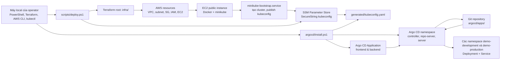
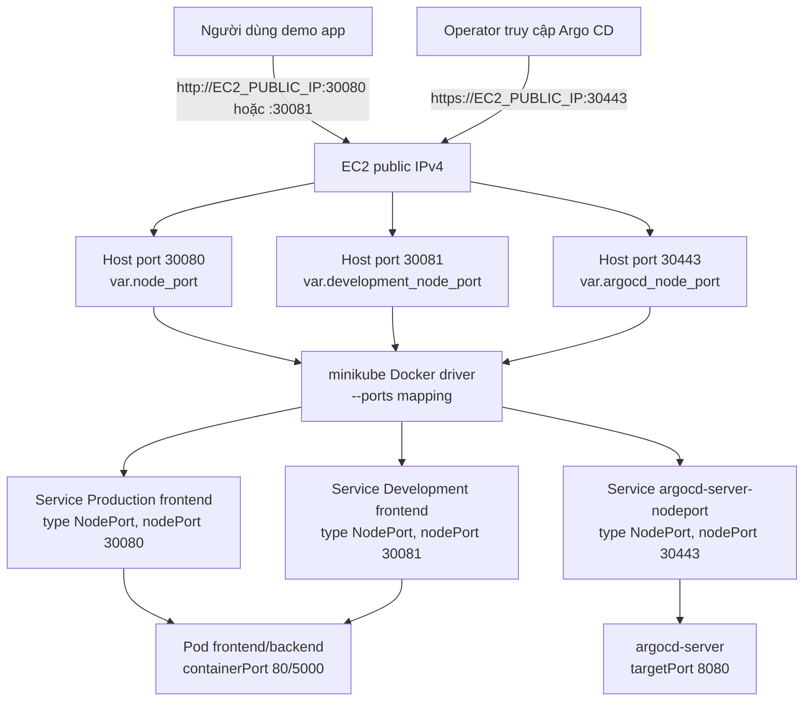
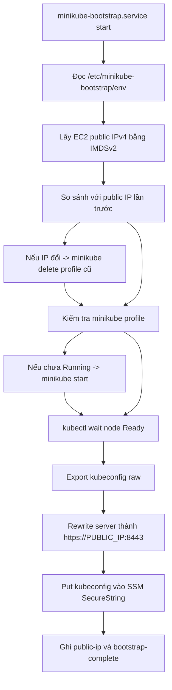
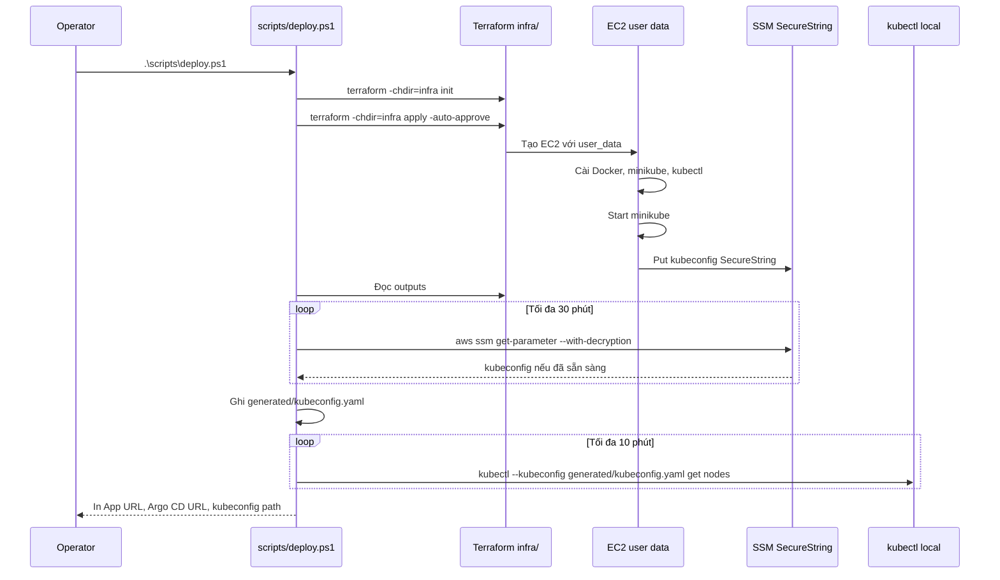
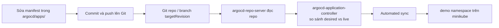

# HOW IT WORKS - Terraform AWS Minikube Sandbox

Tài liệu này giải thích cách repository triển khai hạ tầng, cách EC2 bootstrap minikube, cách kubeconfig được đưa về máy local, và đặc biệt cách Argo CD tiếp quản việc deploy ứng dụng Kubernetes.

Điểm quan trọng nhất của kiến trúc hiện tại:

- Terraform chỉ quản lý AWS infrastructure và bootstrap minikube.
- Argo CD quản lý Kubernetes application delivery.
- Không còn Terraform root `app/`.
- Không còn Terraform-managed `demo` namespace, `Deployment`, hay `Service`.
- Không dùng ALB, không dùng Elastic IP, không dùng Kubernetes `LoadBalancer`.
- Traffic đi trực tiếp vào public IPv4 của EC2 qua NodePort.

## 1. Ownership Boundary

| Phần | Công cụ quản lý | File chính |
| --- | --- | --- |
| AWS infrastructure | Terraform | `infra/` |
| VPC và EC2 module wrapper | Terraform local modules | `modules/vpc/`, `modules/ec2-instance/` |
| EC2 bootstrap và minikube | EC2 user data + systemd | `infra/templates/minikube-user-data.sh.tftpl` |
| Lấy kubeconfig về local | PowerShell + AWS SSM | `scripts/deploy.ps1`, `scripts/fetch-kube-config.ps1` |
| Cài Argo CD | kubectl + Kustomize | `argocd/install.ps1`, `argocd/install/` |
| Kubernetes app | Argo CD | `argocd/bootstrap/apps-applicationset.yaml`, `argocd/apps/*/base/`, `argocd/apps/*/overlays/` |
| Gỡ Argo CD | kubectl | `argocd/uninstall.ps1` |
| Destroy AWS infra | Terraform | `scripts/destroy.ps1` |

Ranh giới này giúp repo tránh việc Terraform phải quản lý Kubernetes resources khi Kubernetes API chưa tồn tại ở thời điểm `terraform apply` bắt đầu. Terraform tạo remote minikube cluster trước. Sau đó Argo CD được cài vào cluster và bắt đầu sync app từ Git.

## 2. Sơ Đồ Kiến Trúc Tổng Thể



Luồng trên chia thành hai pha:

1. `scripts/deploy.ps1` triển khai AWS infra, đợi EC2 bootstrap minikube, lấy kubeconfig từ SSM về `generated/kubeconfig.yaml`.
2. `argocd/install.ps1` dùng kubeconfig đó để cài Argo CD và tạo Argo CD `Application`.

Đây là lý do Argo CD không nằm trong Terraform apply flow. Terraform không cần Kubernetes provider để tạo app. Sau khi cluster tồn tại, Argo CD mới chịu trách nhiệm sync Kubernetes resources.

## 3. Sơ Đồ Traffic

Stack hiện tại expose app và Argo CD bằng NodePort trên EC2 public IP.



Các port chính:

| Port | Terraform variable | Mục đích | Security group CIDR |
| --- | --- | --- | --- |
| `8443` | `kubernetes_api_port` | Kubernetes API của minikube | `allowed_kubernetes_api_cidr` hoặc operator `/32` |
| `30080` | `node_port` | NodePort ứng dụng Production frontend | `allowed_app_cidr`, `allowed_http_cidr`, hoặc operator `/32` |
| `30081` | `development_node_port` | NodePort ứng dụng Development frontend | `allowed_app_cidr`, `allowed_http_cidr`, hoặc operator `/32` |
| `30443` | `argocd_node_port` | Argo CD UI/API NodePort | `allowed_argocd_cidr` hoặc operator `/32` |

`allowed_kubernetes_api_cidr` và `allowed_argocd_cidr` bị validate để không cho dùng `0.0.0.0/0`. App CIDR có thể mở rộng hơn, nhưng nên cân nhắc vì đây là public NodePort trên EC2.

## 4. Terraform Deploy Infra Như Thế Nào

### 4.1. Terraform root `infra/`

`infra/versions.tf` đặt version floor:

- Terraform `>= 1.5.7, < 2.0`.
- AWS provider `>= 6.37, < 7.0`.
- HTTP provider `>= 3.5, < 4.0`.

`infra/main.tf` tạo hai module:

- `module "vpc"` gọi local wrapper `../modules/vpc`.
- `module "minikube_host"` gọi local wrapper `../modules/ec2-instance`.

Local wrapper `modules/vpc` pin upstream `terraform-aws-modules/vpc/aws` version `6.6.1`.

Local wrapper `modules/ec2-instance` pin upstream `terraform-aws-modules/ec2-instance/aws` version `6.4.0`.

### 4.2. VPC

VPC được cấu hình cho sandbox chi phí thấp:

- CIDR mặc định `10.40.0.0/16`.
- Một public subnet.
- `map_public_ip_on_launch = true`.
- Không NAT Gateway.
- Không Elastic IP.
- Không Application Load Balancer.
- Không private app tier.

EC2 host nằm trong public subnet này và nhận public IPv4 động từ AWS.

### 4.3. EC2 minikube host

EC2 được tạo bởi `module "minikube_host"` với các điểm chính:

- Instance type mặc định `t4g.small`.
- AMI là Amazon Linux 2023, chọn theo architecture của instance type.
- Nếu instance type dạng Graviton như `t4g.small`, AMI architecture là `arm64`.
- Public IP được gán trực tiếp, nhưng không tạo Elastic IP.
- Root EBS volume `gp3`, encrypted, mặc định 30 GiB.
- IMDSv2 bắt buộc với `http_tokens = "required"`.
- `instance_initiated_shutdown_behavior = "stop"`.
- `user_data_replace_on_change = true`.

`user_data_replace_on_change = true` nghĩa là nếu bootstrap template thay đổi, Terraform plan có thể thay EC2 instance. Khi thay EC2, minikube cluster bên trong instance cũng bị tạo lại.

### 4.4. Auto-detect operator CIDR

`infra/locals.tf` dùng HTTP provider gọi:

```text
https://checkip.amazonaws.com
```

Nếu `allowed_kubernetes_api_cidr = null`, Terraform lấy public IPv4 hiện tại của máy chạy Terraform và chuyển thành `/32`.

CIDR này được dùng cho Kubernetes API. App và Argo CD cũng có thể kế thừa CIDR này nếu `allowed_app_cidr` hoặc `allowed_argocd_cidr` là `null`.

Điều này giúp mặc định an toàn hơn so với mở API ra toàn internet. Nhưng nếu public IP của bạn thay đổi, bạn cần apply lại infra để security group cho phép IP mới.

### 4.5. IAM và SSM kubeconfig

EC2 có IAM role gồm:

- `AmazonSSMManagedInstanceCore`, để instance hoạt động với AWS Systems Manager.
- Custom policy `aws_iam_policy.kubeconfig_writer`, cho phép ghi đúng một SSM parameter chứa kubeconfig.
- KMS encrypt permissions bị ràng buộc qua SSM service trong đúng account.

Kubeconfig được lưu trong SSM Parameter Store dạng `SecureString`. Local script tải kubeconfig bằng `aws ssm get-parameter --with-decryption` và ghi vào:

```text
generated/kubeconfig.yaml
```

File này đã được git-ignore.

## 5. EC2 Bootstrap Minikube

Bootstrap nằm ở:

```text
infra/templates/minikube-user-data.sh.tftpl
```

Đây là custom component quan trọng nhất của infra. Terraform render template này thành EC2 user data và truyền vào các giá trị như:

- AWS region.
- Kubernetes version.
- minikube version.
- kubectl version.
- Kubernetes API port.
- App NodePort.
- Argo CD NodePort.
- SSM parameter name cho kubeconfig.

### 5.1. User data làm gì khi EC2 boot

User data chạy các bước:

1. `dnf update -y`.
2. Cài `awscli-2`, `conntrack-tools`, và `docker`.
3. Enable và start Docker.
4. Tạo Linux user `minikube` nếu chưa có.
5. Thêm user `minikube` vào group `docker`.
6. Detect architecture của EC2: `arm64` hoặc `amd64`.
7. Tải minikube binary theo `minikube_version`.
8. Tải kubectl binary theo `kubectl_version`.
9. Ghi `/etc/minikube-bootstrap/env`.
10. Tạo `/usr/local/sbin/minikube-bootstrap.sh`.
11. Tạo systemd unit `minikube-bootstrap.service`.
12. Enable và start service.

### 5.2. `minikube-bootstrap.service`

Systemd service này chạy bootstrap thật sự và có thể chạy lại sau khi EC2 reboot.



Các chi tiết quan trọng:

- Service lấy public IPv4 bằng IMDSv2.
- Nếu public IP thay đổi sau stop/start, service xóa minikube profile cũ và tạo lại. Việc này cần thiết vì Kubernetes API certificate phải chứa public IP mới.
- `minikube start` dùng Docker driver và container runtime `containerd`.
- Minikube listen trên `0.0.0.0`.
- API server dùng port `8443`.
- `--apiserver-ips="$PUBLIC_IPV4"` đưa public IP vào certificate SAN.
- `--ports` map ba port từ minikube Docker container ra EC2 host:
  - `8443:8443` cho Kubernetes API.
  - `30443:30443` cho Argo CD.
  - `30080:30080` cho demo app.
- Kubeconfig raw được rewrite để `server:` trỏ về `https://PUBLIC_IPV4:8443`.
- Kubeconfig public được publish vào SSM `SecureString`.

Bootstrap logs:

```text
/var/log/minikube-user-data.log
/var/log/minikube-bootstrap.log
```

## 6. `scripts/deploy.ps1` Làm Gì

Lệnh deploy:

```powershell
.\scripts\deploy.ps1
```

Script này không cài Argo CD. Nó chỉ deploy AWS infra, đợi minikube sẵn sàng, và lấy kubeconfig về local.



Sau khi `deploy.ps1` thành công:

- AWS infra đã được tạo.
- EC2 đang chạy minikube.
- Kubernetes API reachable từ máy local qua `generated/kubeconfig.yaml`.
- Terraform outputs đã có `app_url` và `argocd_url`.
- Argo CD và app chưa nhất thiết đã tồn tại. Chúng được tạo ở pha `argocd/install.ps1`.

## 7. Argo CD Là Trung Tâm Của App Delivery

Thư mục `argocd/` gồm:

```text
argocd/
|-- install/                 # Argo CD installation overlay
|-- bootstrap/               # Tài nguyên bootstrap Argo CD ApplicationSet
|-- apps/                    # Wrappers và các ứng dụng được đồng bộ bởi Argo CD
|-- install.ps1              # Cài Argo CD và apply ApplicationSet
`-- uninstall.ps1            # Gỡ Argo CD khỏi remote cluster
```

### 7.1. Argo CD install overlay

`argocd/install/kustomization.yaml` gồm:

```text
argocd/install/namespace.yaml
https://raw.githubusercontent.com/argoproj/argo-cd/v3.4.3/manifests/install.yaml
argocd/install/argocd-server-nodeport.yaml
```

Project không viết lại toàn bộ manifest Argo CD. Nó dùng upstream Argo CD install manifest version `v3.4.3`, rồi thêm hai phần local:

- Namespace `argocd`.
- Service `argocd-server-nodeport`.

`argocd-server-nodeport.yaml` là custom Service để expose Argo CD UI/API:

- Name: `argocd-server-nodeport`.
- Namespace: `argocd`.
- Type: `NodePort`.
- Service port: `443`.
- Target port: `8080`.
- NodePort: `30443`.
- Selector: `app.kubernetes.io/name: argocd-server`.

Vì EC2 security group mở port `30443` và minikube bootstrap map port `30443`, bạn truy cập Argo CD bằng:

```text
https://EC2_PUBLIC_IP:30443/
```

Argo CD server dùng certificate tự ký, nên browser có thể hiện TLS warning.

### 7.2. `argocd/install.ps1`

Lệnh cài Argo CD:

```powershell
.\argocd\install.ps1 `
  -RepoUrl "https://github.com/*/test-argocd.git" `
  -TargetRevision "main"
```

Script làm các bước:

1. Dùng kubeconfig mặc định `generated\kubeconfig.yaml`, trừ khi truyền `-KubeconfigPath`.
2. Nếu không truyền `-RepoUrl`, script thử đọc Git remote của workspace.
3. Apply Argo CD install overlay bằng server-side apply:

```powershell
kubectl --kubeconfig generated\kubeconfig.yaml apply `
  --server-side=true `
  --force-conflicts `
  --field-manager=argocd-installer `
  -k argocd/install
```

Server-side apply là điểm quan trọng. CRD của Argo CD, đặc biệt `applicationsets.argoproj.io`, có annotation rất lớn. Nếu dùng client-side apply thông thường, có thể gặp lỗi:

```text
metadata.annotations: Too long: may not be more than 262144 bytes
```

4. Đợi ba CRD của Argo CD Established:
   - `applications.argoproj.io`
   - `appprojects.argoproj.io`
   - `applicationsets.argoproj.io`
5. Đợi tất cả deployment trong namespace `argocd` Available.
6. Đợi StatefulSet `argocd-application-controller` rollout xong.
7. Đọc `argocd/bootstrap/apps-applicationset.yaml`, thay repo URL và target revision theo tham số, rồi apply Argo CD `ApplicationSet`.
8. In Argo CD URL và demo app URL từ Terraform outputs nếu đọc được.

### 7.3. Argo CD ApplicationSet

`argocd/bootstrap/apps-applicationset.yaml` khai báo một Argo CD `ApplicationSet` tên là `sandbox-apps` sử dụng Git generator để tự động phát hiện và quản lý các môi trường ứng dụng riêng biệt.

Nó quét các đường dẫn khớp với:
- `argocd/apps/*/overlays/*` (ví dụ: `argocd/apps/backend/overlays/production` và `argocd/apps/backend/overlays/production`).

Với mỗi môi trường tìm thấy, nó sẽ tự động tạo một tài nguyên `Application` với các cấu hình sau:

| Thiết lập | Giá trị / Hành vi |
| --- | --- |
| **Project** | `sandbox` (được định nghĩa là một `AppProject` tùy chỉnh trong cùng manifest bootstrap). |
| **Đường dẫn nguồn** | Đường dẫn do generator tìm được (ví dụ: `argocd/apps/backend/overlays/production`). |
| **Namespace đích** | Namespace tương ứng với môi trường (ví dụ: `demo-development` hoặc `demo-production`). |
| **Tự động dọn dẹp** | `prune = true` (các tài nguyên bị xóa khỏi Git sẽ bị xóa khỏi cluster). |
| **Tự động sửa lỗi** | `selfHeal = true` (các thay đổi thủ công trên cluster sẽ bị ghi đè bởi trạng thái trong Git). |
| **Tự động tạo Namespace** | `CreateNamespace = true` (tự động tạo namespace đích nếu chưa tồn tại). |

Sau khi Argo CD đã cài, bạn không cần Terraform để cập nhật app. Muốn đổi app, hãy sửa đổi các manifest trong `argocd/apps/`, push lên Git và để Argo CD tự động đồng bộ.

### 7.4. Demo app manifests

Mỗi thư mục ứng dụng workload riêng lẻ dưới `argocd/apps/` (như `frontend/`, `backend/`, và `database/`) bao gồm:

```text
base/
overlays/development/
overlays/production/
kustomization.yaml
```
Cấu hình base chứa các tài nguyên workload cốt lõi (ví dụ: `Deployment`, `Service`, hoặc `StatefulSet`).

Các overlays bổ sung các namespace cụ thể cho môi trường và số lượng bản sao (replica count):

- Development: namespace `demo-development`, replica bằng `1` (đối với frontend) / `2` (đối với backend), Service `NodePort` bên ngoài trên port `30081`.
- Production: namespace `demo-production`, replica bằng `5`, Service `NodePort` bên ngoài trên port `30080`.

Deployment chia sẻ (ở base) chạy nginx không có đặc quyền:

- Image: `nginxinc/nginx-unprivileged:1.29-alpine`.
- Container port: `8080`.
- Resource requests/limits nhỏ phù hợp với sandbox.
- Liveness và readiness probes trên `/`.
- Pod `securityContext`:
  - `runAsNonRoot: true`.
  - `seccompProfile: RuntimeDefault`.
- Container `securityContext`:
  - `allowPrivilegeEscalation: false`.
  - `runAsUser: 101`.
  - Drop toàn bộ Linux capabilities.

Mỗi overlay môi trường sẽ patch service để expose app:

- Service name: `frontend` hoặc `backend`.
- Type: `NodePort`.
- Service port: `80`.
- Target port: `http`, trỏ vào container port `8080`.
- Development NodePort: `30081`.
- Production NodePort: `30080`.

Mỗi NodePort ứng dụng phải khớp ở ba nơi:

- Biến `node_port` hoặc `development_node_port` trong `infra/variables.tf`.
- EC2 security group ingress rule cho app tương ứng.
- Minikube bootstrap `--ports` mapping cho port đó.

Nếu bạn đổi bất kỳ NodePort nào của app, hãy cập nhật cả biến Terraform và Kustomize overlay Service tương ứng.

## 8. GitOps Workflow Sau Khi Cài Argo CD



Vì `prune` và `selfHeal` đang bật:

- Sửa image, replicas, probes, hoặc resource limits trong Git -> Argo CD update cluster.
- Xóa manifest khỏi Git -> Argo CD prune resource khỏi cluster.
- Sửa trực tiếp Deployment bằng `kubectl edit` -> Argo CD phát hiện drift và sửa lại theo Git.

Đây là workflow chính sau khi stack đã chạy. Terraform không phải công cụ deploy app nữa.

## 9. Các Component Mới Hoặc Custom

### 9.1. Local Terraform wrapper modules

`modules/vpc` và `modules/ec2-instance` là wrapper quanh upstream Terraform modules.

Mục đích:

- Pin version upstream rõ ràng.
- Giữ local docs/examples.
- Tạo contract module ổn định cho repo.
- Tránh viết lại toàn bộ VPC/EC2 resource bằng tay.

### 9.2. `minikube-user-data.sh.tftpl`

Đây là bootstrap riêng của project. Nó biến một EC2 public instance thành remote minikube host:

- Cài Docker, minikube, kubectl.
- Tạo minikube profile.
- Expose Kubernetes API qua public IP và port `8443`.
- Map NodePort cho app và Argo CD ra EC2 host.
- Rewrite kubeconfig để local kubectl truy cập remote cluster.
- Publish kubeconfig vào SSM `SecureString`.
- Xử lý trường hợp EC2 public IP đổi sau stop/start.

### 9.3. `argocd-server-nodeport.yaml`

Custom Service này tạo đường vào Argo CD UI/API:

```text
EC2 public IP:30443 -> minikube port mapping -> argocd-server-nodeport -> argocd-server
```

Nếu không có Service này, Argo CD vẫn chạy trong cluster nhưng bạn phải dùng port-forward mới truy cập được UI.

### 9.4. `argocd/install.ps1`

Script này là cầu nối giữa pha Terraform và pha GitOps:

- Cài Argo CD bằng server-side apply.
- Đợi Argo CD sẵn sàng.
- Tạo Argo CD `Application`.
- Gắn repo URL và branch vào Application.

### 9.5. `argocd/uninstall.ps1`

Script này gỡ chỉ Argo CD khỏi remote cluster (giữ lại app workloads):

```powershell
.\argocd\uninstall.ps1
```

Để chỉ xóa resources của demo app mà không gỡ Argo CD, chạy:

```powershell
.\argocd\uninstall.ps1 -DeleteApps
```

Mặc định, nó xóa các đối tượng Application, namespace `argocd`, cluster RBAC của Argo CD, và Argo CD CRDs. Flag `-DeleteApps` sẽ chỉ xóa các tài nguyên ứng dụng dưới `argocd/apps/` và thoát.

## 10. Các Lệnh Vận Hành Chính

### 10.1. Deploy infra và lấy kubeconfig

```powershell
.\scripts\deploy.ps1
```

Skip Terraform init nếu đã init trước:

```powershell
.\scripts\deploy.ps1 -SkipInit
```

Dùng var file:

```powershell
.\scripts\deploy.ps1 -InfraVarFile="terraform.tfvars"
```

### 10.2. Cài Argo CD và sync app

```powershell
.\argocd\install.ps1 `
  -RepoUrl "https://github.com/*/test-argocd.git" `
  -TargetRevision "main"
```

### 10.3. Kiểm tra cluster, Argo CD, app

```powershell
kubectl --kubeconfig generated\kubeconfig.yaml get nodes
kubectl --kubeconfig generated\kubeconfig.yaml -n argocd get pods,svc
kubectl --kubeconfig generated\kubeconfig.yaml -n argocd get application
kubectl --kubeconfig generated\kubeconfig.yaml -n demo-development get pods,svc
kubectl --kubeconfig generated\kubeconfig.yaml -n demo-production get pods,svc
```

### 10.4. Lấy URL

```powershell
terraform -chdir=infra output -raw production_app_url
terraform -chdir=infra output -raw development_app_url
terraform -chdir=infra output -raw argocd_url
```

### 10.5. Lấy Argo CD admin password

```powershell
$PasswordB64 = kubectl --kubeconfig generated\kubeconfig.yaml -n argocd get secret argocd-initial-admin-secret -o jsonpath="{.data.password}"
[System.Text.Encoding]::UTF8.GetString([System.Convert]::FromBase64String($PasswordB64))
```

Username mặc định:

```text
admin
```

### 10.6. Gỡ Argo CD

```powershell
.\argocd\uninstall.ps1
```

Xóa chỉ resources của demo app workload:

```powershell
.\argocd\uninstall.ps1 -DeleteApps
```

### 10.7. Destroy toàn bộ AWS infra

```powershell
.\scripts\destroy.ps1
```

Destroy infra sẽ terminate EC2. Vì minikube và Argo CD chạy bên trong EC2, toàn bộ Kubernetes resources trong cluster cũng mất theo EC2.

## 11. Troubleshooting Theo Từng Lớp

### 11.1. Terraform apply xong nhưng deploy script đợi kubeconfig quá lâu

Kiểm tra EC2 bootstrap logs qua SSM:

```powershell
$InstanceId = terraform -chdir=infra output -raw instance_id
$Region = terraform -chdir=infra output -raw aws_region

aws ssm send-command `
  --region $Region `
  --instance-ids $InstanceId `
  --document-name AWS-RunShellScript `
  --parameters 'commands=["systemctl status minikube-bootstrap --no-pager","tail -n 240 /var/log/minikube-bootstrap.log"]'
```

Nguyên nhân hay gặp:

- EC2 chưa tải xong minikube hoặc kubectl.
- Docker chưa sẵn sàng.
- Minikube start chậm do instance nhỏ.
- EC2 thiếu permission `ssm:PutParameter`.
- Kubeconfig trong SSM chưa trỏ đúng `https://EC2_PUBLIC_IP:8443`.

### 11.2. `kubectl get nodes` không kết nối được

Kiểm tra:

- `generated/kubeconfig.yaml` có tồn tại không.
- Security group có mở `kubernetes_api_port` cho public IP hiện tại của bạn không.
- EC2 có public IPv4 mới sau stop/start không.
- Kubeconfig có `server: https://EC2_PUBLIC_IP:8443` không.

Nếu EC2 public IP đổi, systemd service sẽ recreate minikube profile và publish kubeconfig mới. Chạy lại:

```powershell
.\scripts\deploy.ps1 -SkipInit
```

để fetch kubeconfig mới về local.

### 11.3. Cài Argo CD gặp lỗi CRD annotation quá lớn

Không dùng client-side `kubectl apply -k argocd/install` cho overlay Argo CD. Dùng script:

```powershell
.\argocd\install.ps1 -RepoUrl "https://github.com/*/test-argocd.git" -TargetRevision "main"
```

Script đã dùng server-side apply để tránh lỗi annotation quá lớn của CRD.

Kiểm tra Application:

```powershell
kubectl --kubeconfig generated\kubeconfig.yaml -n argocd get application frontend-production -o yaml
kubectl --kubeconfig generated\kubeconfig.yaml -n argocd get application backend-production -o yaml
```

Kiểm tra các điểm sau:

- `repoURL` có đúng repo mà Argo CD truy cập được không.
- `targetRevision` có đúng branch/tag không.
- `path` có đúng `argocd/apps/backend/overlays/production` hoặc `argocd/apps/backend/overlays/production` không.
- Repo có chứa Kubernetes manifests hợp lệ không.
- Nếu repo private, cần cấu hình repository credentials cho Argo CD bằng cách tải chúng lên AWS Secrets Manager với [upload-secrets-to-aws.ps1](file:///E:/code-folder/xbrain_projects/minikube-aws-sandbox/scripts/upload-secrets-to-aws.ps1).

### 11.5. Argo CD URL mở được nhưng browser báo certificate warning

Đây là trạng thái hiện tại. `argocd-server` dùng TLS certificate tự ký trong cluster.

Truy cập:

```text
https://EC2_PUBLIC_IP:30443/
```

Trong sandbox này, có thể accept warning. Nếu muốn production-like, cần domain, TLS certificate thật, và ingress/load balancer riêng.

## 12. Khi Mở Rộng Project

- Nếu thêm app mới, tạo thư mục mới dưới `argocd/apps/` (ví dụ: `argocd/apps/my-new-app/overlays/development`). Argo CD `ApplicationSet` sẽ tự động phát hiện đường dẫn overlay mới và tạo tài nguyên `Application` tương ứng.
- Nếu app mới cần NodePort khác, phải cập nhật Terraform security group, minikube port mapping, và Kubernetes Service manifest.
- Nếu dùng private Git repo, cần thêm repo credentials cho Argo CD bằng cách tải chúng lên AWS Secrets Manager với [upload-secrets-to-aws.ps1](file:///E:/code-folder/xbrain_projects/minikube-aws-sandbox/scripts/upload-secrets-to-aws.ps1).
- Nếu muốn endpoint ổn định, cần thêm Elastic IP hoặc DNS. Hiện tại public IP của EC2 có thể đổi sau stop/start.
- Nếu muốn production Kubernetes, không nên xem minikube trên EC2 là thay thế EKS. Đây là sandbox chi phí thấp để học và demo GitOps.
- Nếu muốn app delivery đúng GitOps, không sửa app resources trực tiếp bằng `kubectl`; hãy sửa manifest trong Git và để Argo CD sync.

## 13. Giải Thích Sâu: Bảo Mật Nền Tảng, Cô Lập Mạng, và Chuỗi Cung Ứng An Toàn (Supply Chain Delivery)

Phần này giải thích chi tiết cách các thành phần cấu hình nền tảng, ứng dụng, chính sách bảo mật, và controller hoạt động cùng nhau để tạo ra một môi trường sandbox đa tenant và an toàn.

### 13.1. Trình Tự Khởi Tạo (Bootstrapping Sequence) và Sync Waves

Để triển khai các tài nguyên mà không gặp lỗi xung đột phụ thuộc (ví dụ: việc triển khai ứng dụng backend trước khi namespace hay các controller bảo mật sẵn sàng), `ApplicationSet` `sandbox-apps` trong [apps-applicationset.yaml](file:///E:/code-folder/xbrain_projects/minikube-aws-sandbox/argocd/bootstrap/apps-applicationset.yaml) áp dụng thứ tự phân cấp qua annotation `argocd.argoproj.io/sync-wave`:

| Wave | Ứng dụng (Application) | Namespace Đích | Mục đích |
| --- | --- | --- | --- |
| `-10` | `tenant-namespaces` | Mức Cluster | Khởi tạo cả hai namespace `demo-development` và `demo-production`, cùng quotas và limits. |
| `-5` | `database` | `demo-*` | Triển khai Redis stateful database trước khi chạy logic backend. |
| `-4` | `team-rbac` | `demo-*` | Thiết lập vai trò và liên kết phân quyền Developer RBAC theo môi trường. |
| `-3` | `network-policies` | `demo-*` | Cấu hình cô lập mạng giữa các tenant (được thực thi qua Calico CNI). |
| `-2` | `gatekeeper-policies` | `gatekeeper-production` | Cài đặt các ràng buộc / hồ sơ bảo mật OPA Gatekeeper. |
| `0` | `backend` | `demo-*` | Triển khai backend Go (Rollouts có kiểm tra metrics). |
| `2` | `cosign-policies` | `cosign-system` | Áp dụng chính sách xác thực chữ ký ảnh bằng Sigstore controller. |
| `5` | `frontend` | `demo-*` | Triển khai các dịch vụ Web frontend hướng tới người dùng ở bước cuối cùng. |

### 13.2. Calico CNI và Cô Lập Mạng Mức Pod

Mặc định, môi trường minikube cơ bản không có CNI hỗ trợ cô lập chính sách mạng (các đối tượng `NetworkPolicy` được API chấp nhận nhưng sẽ bị bỏ qua).
- **Bật Thực Thi**: File cấu hình khởi tạo của EC2 trong [minikube-user-data.sh.tftpl](file:///E:/code-folder/xbrain_projects/minikube-aws-sandbox/infra/templates/minikube-user-data.sh.tftpl) khởi động minikube với tùy chọn `--cni=calico`.
- **Chính Sách Cô Lập Egress**: Ứng dụng `network-policies` triển khai [egress-same-namespace-and-dns.yaml](file:///E:/code-folder/xbrain_projects/minikube-aws-sandbox/argocd/apps/network-policies/base/egress-same-namespace-and-dns.yaml).
  - Nó chặn toàn bộ kết nối ra ngoài (egress) của pod, chỉ cho phép kết nối đến các pod trong **cùng namespace**, ngăn chặn việc gọi chéo giữa các tenant (ví dụ: các pod trong `demo-development` gọi chéo sang `demo-production`).
  - Cho phép kết nối DNS (UDP/TCP cổng 53) đến CoreDNS (`kube-dns` trong namespace `kube-system`) để đảm bảo hệ thống có thể phân giải tên miền dịch vụ.

### 13.3. Các Chính Sách Bảo Mật OPA Gatekeeper

OPA Gatekeeper kiểm soát việc tuân thủ cấu hình một cách động:
- **Nhắm Mục Tiêu Theo Nhãn**: Thay vì liệt kê danh sách namespace cứng, các ràng buộc sử dụng `namespaceSelector` nhắm vào nhãn bảo mật:
  ```yaml
  namespaceSelector:
    matchLabels:
      platform.xbrain.dev/security-profile: demo-restricted
  ```
- **Các Chính Sách Thực Thi**:
  - `pods-must-have-app-label`: Đảm bảo mọi pod đều có nhãn `app` phục vụ việc truy vết logs và Prometheus metrics.
  - `allowed-repos-constraint`: Từ chối tất cả container images ngoài registry được cho phép (ví dụ: bắt buộc phải khớp `docker.io/tqhung0105/*`).
  - `disallow-latest-tag-constraint`: Chặn việc sử dụng tag không cố định (như `:latest`), ép buộc gán tag cụ thể hoặc digest.
  - `required-resource-limits-constraint`: Ràng buộc giới hạn CPU và RAM để bảo vệ nút (node) khỏi tấn công làm cạn kiệt tài nguyên.
  - `disallow-root-user-constraint`: Buộc container chạy dưới dạng không có quyền root (`runAsNonRoot: true`).
  - `disallow-host-network-constraint`: Chặn container sử dụng không gian mạng của host.

### 13.4. Bảo Mật Chuỗi Cung Ứng Với Sigstore Cosign

Ngăn chặn các container image không hợp lệ hoặc chứa mã độc thực thi trong cluster:
- **Ký Ảnh (Image Signing)**: Luồng CI/CD trong `.github/workflows/ci.yaml` tự động ký các container image được build bằng Cosign, sử dụng khóa lưu trữ trong AWS Secrets Manager.
- **Xác Thực (Verification)**: Ứng dụng `cosign-policies` triển khai cấu hình kiểm tra chữ ký thông qua Sigstore `policy-controller`.
  - Controller này chặn bắt các yêu cầu admission của pod trong các tenant namespace có nhãn `policy.sigstore.dev/include: "true"`.
  - Nó sử dụng khóa công khai [cosign.pub](file:///E:/code-folder/xbrain_projects/minikube-aws-sandbox/cosign/cosign.pub) để xác minh tính toàn vẹn. Mọi container image không có chữ ký hợp lệ sẽ bị từ chối chạy ngay lập tức.

### 13.5. Kiểm Soát Truy Cập Dựa Trên Vai Trò (RBAC) Đa Tenant

Liên kết danh tính người dùng OIDC với các hành vi được phép trong cluster:
- **Giới Hạn Quyền Hạn**: Role `demo-developer` được định nghĩa trong `team-rbac/base/role.yaml` chỉ có quyền trên các tài nguyên thiết yếu trong namespace của họ (pods, service logs, configmaps, services, rollouts). Developer bị chặn hoàn toàn khỏi việc đọc secrets, quản lý node, namespace hoặc các phân quyền cluster-wide.
- **Liên Kết Động (Dynamic Bindings)**: Các overlay môi trường gán quyền này cho các group OIDC tương ứng:
  - Overlay `production` liên kết group `oidc:demo-developers` với role trong namespace `demo-production`.
  - Overlay `development` liên kết group `oidc:demo-development-developers` với role trong namespace `demo-development`.
  - Điều này đảm bảo tính phân tách nhiệm vụ và ngăn cản nhà phát triển can thiệp vào môi trường của nhau.

### 13.6. Định Mức Tài Nguyên và Giới Hạn Namespace (ResourceQuota và LimitRange)

Để ngăn chặn cạn kiệt tài nguyên hệ thống và tránh hiện tượng "noisy neighbor" (ảnh hưởng tài nguyên lẫn nhau) trên node minikube dùng chung:
- **ResourceQuota Cấp Namespace**: Ứng dụng `tenant-namespaces` triển khai một `ResourceQuota` tên `tenant-quota` trong cả hai namespace `demo-development` và `demo-production`. Nó giới hạn tổng lượng tài nguyên tiêu thụ tối đa (như CPU, Memory, số lượng Pod) trong từng namespace.
- **Tự Động Inject LimitRange**: Một `LimitRange` tên `tenant-limits` định nghĩa các request và limit mặc định về CPU/RAM cho bất kỳ container nào khởi tạo trong namespace của tenant mà bản thân manifest của nó không khai báo resource. Nó đồng thời áp đặt ranh giới min/max cho phép. Cấu hình này giúp vượt qua cơ chế chặn thiếu resource limits của Gatekeeper đối với các pod gỡ lỗi (troubleshoot/dry-run) và đảm bảo các container luôn chạy trong phạm vi tài nguyên an toàn.
