# Evidence pack - Demo Terraform AWS kind ALB

Cập nhật lần cuối: 2026-06-04

[English](EVIDENCE_PACK.md)

Evidence pack này mô tả cách project đáp ứng yêu cầu:

> Dựng 1 EC2 instance, chạy một Kubernetes cluster local bằng kind hoặc
> minikube, deploy một app nhỏ nhẹ vào Kubernetes, expose app ra Internet qua
> AWS Application Load Balancer, và tự động hóa toàn bộ bằng Terraform với ít
> nhất hai Terraform provider.

## 1. Tổng Quan Project

Repository này dựng một demo Kubernetes nhỏ trên AWS bằng Terraform.

- `infra/` tạo hạ tầng AWS: VPC, public subnets, EC2, IAM role, security groups, Application Load Balancer, listener, target group và target attachment.
- EC2 được bootstrap bằng `user_data` để cài Docker, kind, kubectl, và tạo một single-node kind cluster.
- EC2 ghi kubeconfig được tạo ra vào AWS Systems Manager Parameter Store dưới dạng `SecureString`.
- `scripts/deploy.ps1` tải kubeconfig đó về `generated/kubeconfig.yaml`.
- `app/` dùng Terraform Kubernetes provider để deploy app vào kind cluster dưới dạng Deployment và expose bằng Service kiểu NodePort.
- ALB forward traffic từ Internet vào NodePort trên EC2, sau đó Kubernetes route traffic đến Pod của app.

Các giá trị cấu hình hiện tại của project:

| Hạng mục | Giá trị |
|---|---|
| AWS region | `ap-southeast-1` |
| Name prefix | `hungqt-tf-kind` |
| Kubernetes distribution | `kind` |
| Tên kind cluster | `terraform-demo` |
| EC2 instance type | `t3.medium` |
| NodePort | `30080` |
| Kubernetes namespace | `demo` |
| Tên Kubernetes app | `demo-app` |
| Container image | `nginxinc/nginx-unprivileged:1.29-alpine` |
| SSM kubeconfig parameter | `/hungqt-tf-kind/kind/kubeconfig` |
| Lệnh deploy một bước | `.\scripts\deploy.ps1` |
| Lệnh destroy | `.\scripts\destroy.ps1` |

## 2. Bằng Chứng Kiến Trúc

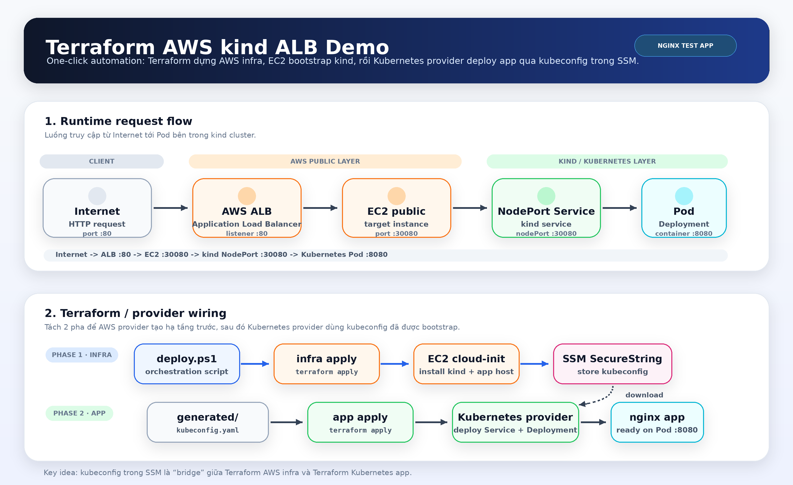

Luồng request:

```text
Internet
  -> AWS Application Load Balancer :80
  -> EC2 public instance :30080
  -> kind NodePort Service :30080
  -> Kubernetes Deployment Pod :8080
```

Luồng Terraform/provider:

```text
scripts/deploy.ps1
  -> terraform -chdir=infra apply
  -> EC2 cloud-init tạo kind và ghi kubeconfig vào SSM
  -> script tải SSM SecureString về generated/kubeconfig.yaml
  -> terraform -chdir=app apply dùng Kubernetes provider
```

## 3. Ma Trận Đáp Ứng Yêu Cầu

| Yêu cầu | Project đáp ứng như thế nào |
|---|---|
| Hạ tầng được tạo bằng Terraform | Terraform root `infra/` tạo VPC, EC2, IAM, security groups, ALB, target group, listener và target attachment qua AWS provider. |
| Một EC2 host chạy Kubernetes local | EC2 `user_data` cài Docker, kind và kubectl, sau đó tạo single-node kind cluster. |
| App chạy bên trong Kubernetes | Terraform root `app/` tạo Kubernetes Namespace, Deployment và NodePort Service bằng Kubernetes provider. |
| App không cài trực tiếp trên EC2 | EC2 chỉ chạy Docker/kind; HTTP workload là Kubernetes Deployment dùng image `nginxinc/nginx-unprivileged:1.29-alpine`. |
| App truy cập được từ Internet qua ALB | ALB listener forward đến target group trỏ vào EC2 NodePort `30080`; Service route request đến Pod. |
| Tự động hóa bằng một lệnh | `.\scripts\deploy.ps1` chạy infra apply, đợi SSM kubeconfig, chạy app apply, đợi rollout và in ALB URL. | 
| Dùng ít nhất hai Terraform provider | `infra/` dùng `hashicorp/aws` và `hashicorp/http`; `app/` dùng `hashicorp/kubernetes`. |
| Wire provider khác một cách động | Kubernetes provider đọc `generated/kubeconfig.yaml`, file này được tạo từ infra output và EC2 bootstrap thông qua SSM. |

## 4. Bằng Chứng Deploy Một Lệnh

Lệnh:

```powershell
.\scripts\deploy.ps1
```

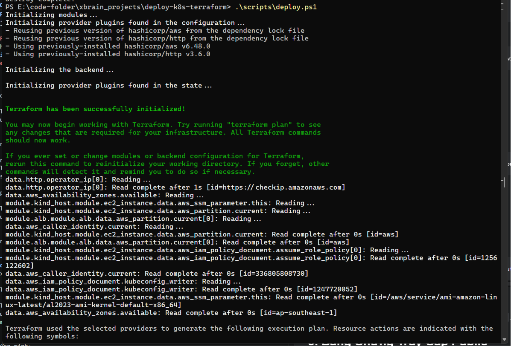

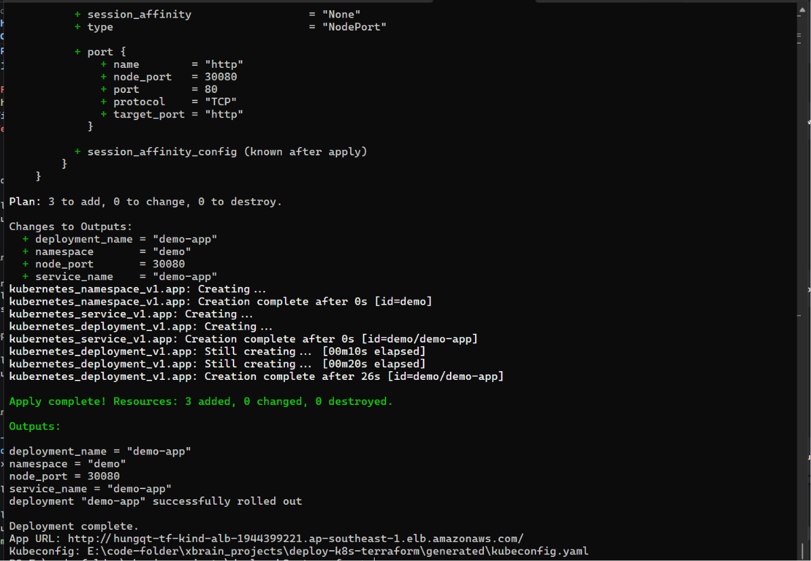

Điều này chứng minh:

- Terraform init và apply AWS infrastructure root.
- EC2 bootstrap tạo kind và publish kubeconfig lên SSM.
- Script tải kubeconfig về `generated/kubeconfig.yaml`.
- Terraform init và apply Kubernetes app root.
- Script đợi Deployment rollout và in ALB URL.

## 5. Bằng Chứng Wire Provider

Infra providers:

```powershell
terraform -chdir=infra providers
```

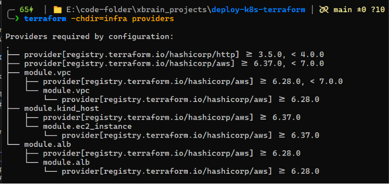

Mô tả:

- Sử dụng AWS provider `registry.terraform.io/hashicorp/aws`
- Sử dụng http provider `registry.terraform.io/hashicorp/http`
- Local wrapper modules trong `modules/`
- Upstream AWS modules cho VPC, EC2 instance và ALB

App provider:

```powershell
terraform -chdir=app providers
```

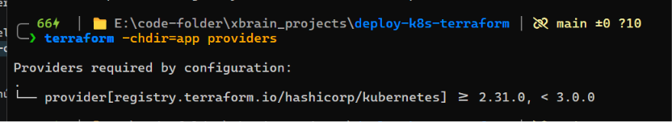

Mô tả:

- Sử dụng Kubernetes provider `registry.terraform.io/hashicorp/kubernetes`

Cầu nối provider:

```text
infra output kubeconfig_ssm_parameter_name
  -> EC2 user_data ghi kubeconfig vào SSM SecureString
  -> scripts/deploy.ps1 tải SSM value về generated/kubeconfig.yaml
  -> app provider "kubernetes" dùng var.kubeconfig_path
```

Bằng chứng trong code:

- `infra/outputs.tf` expose `kubeconfig_ssm_parameter_name`, `node_port` và
  `app_url`.
- `infra/templates/kind-user-data.sh.tftpl` chạy `aws ssm put-parameter`.
- `scripts/deploy.ps1` đọc infra outputs và fetch SSM parameter.
- `app/versions.tf` cấu hình `provider "kubernetes"` với
  `config_path = var.kubeconfig_path`.

## 6. Bằng Chứng Runtime Trên AWS

Chỉ capture metadata. Không in nội dung kubeconfig.

SSM parameter metadata:

```powershell
aws ssm get-parameter ^
  --region ap-southeast-1 ^
  --name /hungqt-tf-kind/kind/kubeconfig ^
  --with-decryption ^
  --query "Parameter.{Name:Name,Type:Type,Version:Version,LastModifiedDate:LastModifiedDate}" ^
  --output json
```

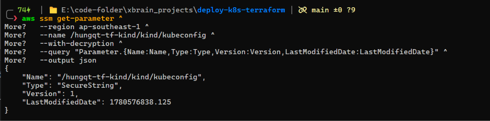

Mô tả:

- `Name` là `/hungqt-tf-kind/kind/kubeconfig`.
- `Type` là `SecureString`.
- `Version` tồn tại.

EC2 instance:

```powershell
$InstanceId = terraform -chdir=infra output -raw kind_host_instance_id
aws ec2 describe-instances `
  --region ap-southeast-1 `
  --instance-ids $InstanceId `
  --query "Reservations[].Instances[].{InstanceId:InstanceId,State:State.Name,PublicIpAddress:PublicIpAddress,IamInstanceProfile:IamInstanceProfile.Arn}" `
  --output table
```

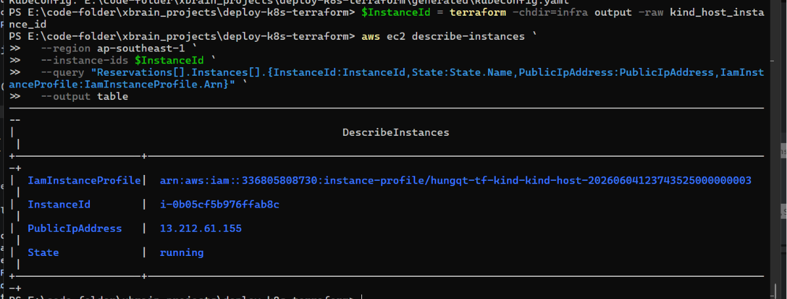

Mô tả:

- Instance state là `running`.
- Instance có IAM instance profile.
- Instance có public IP.

ALB target health:

```powershell
$TargetGroupName = "hungqt-tf-kind-tg"
$TargetGroupArn = aws elbv2 describe-target-groups `
  --region ap-southeast-1 `
  --names $TargetGroupName `
  --query "TargetGroups[0].TargetGroupArn" `
  --output text

aws elbv2 describe-target-health `
  --region ap-southeast-1 `
  --target-group-arn $TargetGroupArn `
  --query "TargetHealthDescriptions[].{Target:Target.Id,Port:Target.Port,State:TargetHealth.State,Reason:TargetHealth.Reason}" `
  --output table
```

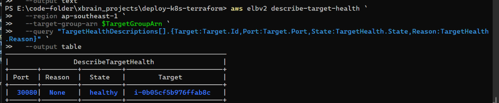

Mô tả:

- Target là EC2 instance.
- Port là `30080`.
- State là `healthy`.

## 7. Bằng Chứng Runtime Trên Kubernetes

Fetch kubeconfig từ SSM:

```powershell
$Region = terraform -chdir=infra output -raw aws_region
$Param = terraform -chdir=infra output -raw kubeconfig_ssm_parameter_name
New-Item -ItemType Directory -Force generated | Out-Null

$Kubeconfig = aws ssm get-parameter `
  --region $Region `
  --name $Param `
  --with-decryption `
  --query "Parameter.Value" `
  --output json | ConvertFrom-Json

[System.IO.File]::WriteAllText(
  (Join-Path (Get-Location) "generated\kubeconfig.yaml"),
  $Kubeconfig,
  [System.Text.UTF8Encoding]::new($false)
)
```

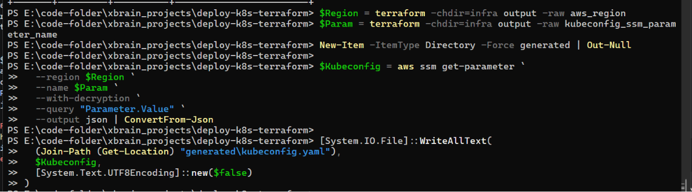

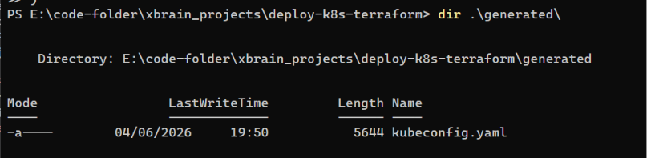

Xác nhận node ready:

```powershell
kubectl --kubeconfig generated\kubeconfig.yaml get nodes -o wide
```

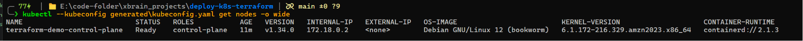

Mô tả:

- Có một kind control-plane node.
- `STATUS` là `Ready`.
- Kubernetes version khớp với kind node image đã cấu hình.

Xác nhận app resources:

```powershell
kubectl --kubeconfig generated\kubeconfig.yaml -n demo get pods,svc -o wide
```

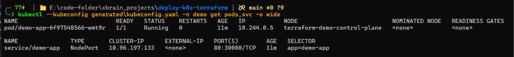

Mô tả:

- Pod `demo-app` ở trạng thái `Running`.
- Service `demo-app` có type `NodePort`.
- Service expose `80:30080/TCP`.

Xác nhận rollout:

```powershell
kubectl --kubeconfig generated\kubeconfig.yaml -n demo rollout status deployment/demo-app --timeout=5m
```

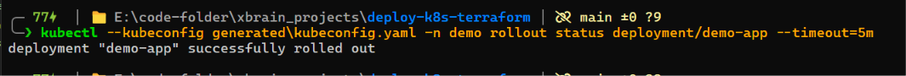

Mô tả:

- Output chứa `deployment "demo-app" successfully rolled out`.

## 8. Bằng Chứng Truy Cập Public

Lấy public URL:

```powershell
$AppUrl = terraform -chdir=infra output -raw app_url
$AppUrl
```

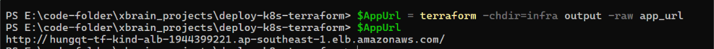

Verify HTTP 200:

```powershell
$Response = Invoke-WebRequest -Uri $AppUrl -UseBasicParsing -TimeoutSec 30
$Response.StatusCode
$Response.Content.Split("`n")[0..4]
```

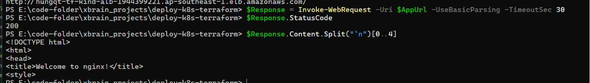

Mô tả:

- Status code là `200`.
- Response chứa HTML welcome page của nginx.
- Request được gửi đến ALB DNS name, không phải EC2 public IP.

## 9. Bằng Chứng Validation

```powershell
terraform -chdir=infra fmt -check
terraform -chdir=infra validate
terraform -chdir=app fmt -check
terraform -chdir=app validate
```

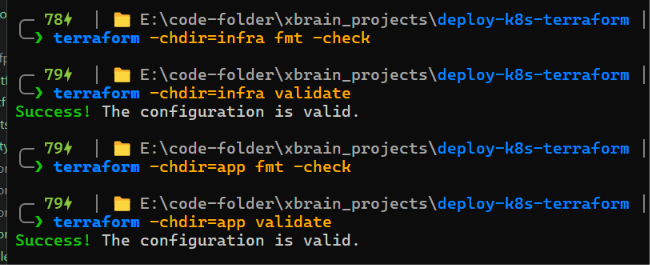

Mô tả:

- Tất cả lệnh chạy thành công.
- `validate` in ra `Success! The configuration is valid.`

## 10. Bằng Chứng Bảo Mật

Các kiểm soát bảo mật cần nêu khi review:

- EC2 không mở SSH ingress mặc định.
- ALB nhận HTTP theo `allowed_http_cidr`.
- EC2 chỉ nhận NodePort traffic từ ALB security group.
- Kubernetes API access được giới hạn bởi `allowed_kubernetes_api_cidr`; khi giá trị này là `null`, Terraform detect public IPv4 của operator và chỉ allow CIDR `/32` đó.
- Kubeconfig được lưu trong SSM Parameter Store dưới dạng `SecureString`.
- `generated/kubeconfig.yaml`, `.terraform/`, `*.tfstate`, `*.tfplan` và `terraform.tfvars` được Git ignore.
- Demo container dùng `nginxinc/nginx-unprivileged:1.29-alpine`, chạy bằng non-root user, drop Linux capabilities, và không cho privilege escalation.

Redaction scan trước khi chia sẻ:

```powershell
rg -n "client-[k]ey-data|client-certificate-[d]ata|BEGIN .*PRIVATE [K]EY|aws_secret_access_[k]ey|A[K]IA|A[S]IA" EVIDENCE_PACK_vi.md evidence
```

Kết quả mong đợi:

- Không có match.

## 11. Bằng Chứng Cleanup

Lệnh destroy:

```powershell
.\scripts\destroy.ps1
```

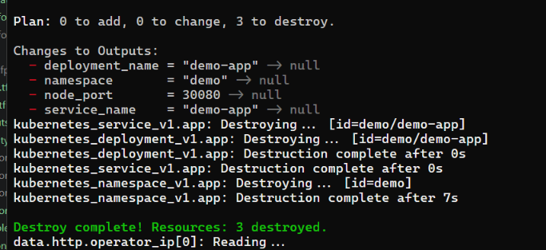

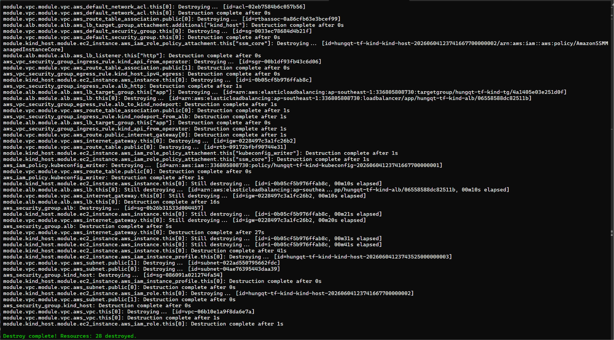

Mô tả:

- Kubernetes resources được destroy trước AWS infrastructure.
- SSM kubeconfig parameter được xóa.
- EC2, ALB, target group, security groups và VPC resources được xóa.

Thứ tự destroy thủ công nếu cần:

```powershell
$Region = terraform -chdir=infra output -raw aws_region
$Param = terraform -chdir=infra output -raw kubeconfig_ssm_parameter_name
$NodePort = terraform -chdir=infra output -raw node_port

terraform -chdir=app destroy `
  -var="kubeconfig_path=../generated/kubeconfig.yaml" `
  -var="node_port=$NodePort"

aws ssm delete-parameter --region $Region --name $Param
terraform -chdir=infra destroy
```

Thứ tự destroy rất quan trọng: xóa Kubernetes resources trước, sau đó mới xóa EC2, ALB và VPC infrastructure.
