## Week 9 - GitOps, Observability và Canary Rollouts

Tài liệu này dùng để nộp minh chứng đã hoàn thành các bài lab trong hai tài liệu:

- `pdf/W9-sang-gitops-final.html` - Buổi sáng: GitOps và CI/CD.
- `pdf/W9-chieu-obs-canary.html` - Buổi chiều: Observability, Canary và Challenge "Ship Smartly".

Repository thực hành: `minikube-aws-sandbox`.

Môi trường triển khai:

- AWS EC2 chạy Docker và minikube.
- Terraform quản lý hạ tầng AWS và publish kubeconfig lên AWS Systems Manager Parameter Store.
- Argo CD quản lý các ứng dụng Kubernetes theo mô hình GitOps.
- Argo Rollouts quản lý canary rollout.
- Prometheus thu thập metrics, đánh giá SLO và gửi cảnh báo.

## Mục lục

1. [Tổng quan kết quả](#1-tổng-quan-kết-quả)
2. [Kiến trúc hệ thống đã triển khai](#2-kiến-trúc-hệ-thống-đã-triển-khai)
3. [Phần I - Lab buổi sáng: GitOps và CI/CD](#3-phần-i---lab-buổi-sáng-gitops-và-cicd)
4. [Phần II - Lab buổi chiều: Observability và Canary](#4-phần-ii---lab-buổi-chiều-observability-và-canary)
5. [Phần III - Dự án cuối khóa: Ship Smartly](#5-phần-iii---dự-án-cuối-khóa-ship-smartly)
6. [Kết luận](#7-kết-luận)

## 1. Tổng quan kết quả

| Nhóm yêu cầu | Minh chứng hoàn thành |
|---|---|
| Dựng môi trường Kubernetes | Terraform tạo hạ tầng AWS, EC2 bootstrap minikube, kubeconfig được tải về `generated/kubeconfig.yaml`. |
| GitOps | Argo CD được cài vào cụm, `ApplicationSet` tự phát hiện các overlay production trong `argocd/apps/*/overlays/production`. |
| CI/CD | Git là nguồn sự thật chính; GitHub Actions chạy kiểm tra `kubectl kustomize` cho manifest. |
| Self-heal | Khi scale lệch tài nguyên trực tiếp bằng `kubectl`, Argo CD phát hiện drift và kéo cụm về trạng thái khai báo trong Git. |
| Rollback | Rollback được thực hiện bằng `git revert`, sau đó Argo CD tự đồng bộ về phiên bản ổn định. |
| Observability | Prometheus scrape backend production tại `/api/v1/metrics` và thu thập metric `go_visit_requests_total`. |
| Canary | Frontend và backend dùng Argo Rollouts với chiến lược canary. |
| SLO và cảnh báo | Prometheus có rule `BackendSuccessRateSLOViolation`, Alertmanager gửi email khi success rate thấp hơn 95%. |
| Auto-abort | Backend `AnalysisTemplate` đọc Prometheus và tự đánh fail canary khi success rate không đạt SLO. |


*Hình 01: Tổng quan cụm đã chạy đủ Argo CD, ứng dụng demo, Prometheus, Argo Rollouts và các tài nguyên liên quan.*

## 2. Kiến trúc hệ thống đã triển khai

Luồng truy cập chính của hệ thống:

```text
Người dùng / trình duyệt
  -> EC2 public IPv4
  -> minikube Docker port mapping
  -> Kubernetes NodePort Service
  -> Frontend Pod
  -> Nginx reverse proxy /api/v1/
  -> Backend Service
  -> Backend Pod
  -> Redis StatefulSet
```

Luồng GitOps:

```text
Git repository
  -> Argo CD ApplicationSet
  -> Kustomize overlays production
  -> Kubernetes resources
  -> Argo Rollouts / Prometheus / app workloads
```

Các endpoint quan trọng:

| Thành phần | Cổng / đường dẫn | Mục đích |
|---|---:|---|
| Frontend production | NodePort `30080` | Giao diện ứng dụng production. |
| Frontend development | NodePort `30081` | Port hạ tầng đã mở sẵn cho môi trường development; overlay development có trong Git nhưng `ApplicationSet` hiện tại chỉ tự phát hiện overlay production. |
| Argo CD | NodePort `30443` | Giao diện quản trị GitOps. |
| Prometheus | NodePort `39090` | Truy vấn metric và alert. |
| Kubernetes API | Host port `8443` | Truy cập cụm bằng kubeconfig. |
| Backend metrics | `/api/v1/metrics` trên port `5000` | Prometheus scrape custom metrics. |

### 2.1. Ngữ cảnh hạ tầng trong `infra/`

Phần `infra/` là lớp tạo nền tảng chạy lab. Terraform không trực tiếp quản lý các workload Kubernetes; Terraform chỉ tạo AWS resources, bootstrap minikube và publish kubeconfig để các bước sau dùng `kubectl` và Argo CD.

| File / thư mục | Vai trò trong bài lab |
|---|---|
| `infra/versions.tf` | Khóa Terraform `>= 1.5.7, < 2.0`, AWS provider `>= 6.37, < 7.0`, HTTP provider `>= 3.5, < 4.0`. |
| `infra/main.tf` | Tạo VPC public subnet và EC2 instance chạy Docker/minikube bằng module local `modules/vpc` và `modules/ec2-instance`. |
| `infra/locals.tf` | Tính operator CIDR, app CIDR, AMI theo kiến trúc `arm64`/`x86_64`, tên SSM parameter chứa kubeconfig và tags. |
| `infra/security.tf` | Mở các cổng cần thiết: Kubernetes API `8443`, app `30080`, development app `30081`, Argo CD `30443`, Prometheus `39090`. |
| `infra/iam.tf` | Cấp quyền cho EC2 ghi đúng một SSM SecureString parameter chứa kubeconfig. |
| `infra/templates/minikube-user-data.sh.tftpl` | Cài Docker, minikube, kubectl; chạy minikube bằng Docker driver; publish kubeconfig public endpoint lên SSM. |
| `infra/outputs.tf` | Xuất URL app, URL Argo CD, public IP, kubeconfig SSM parameter, port API và NodePort. |

Lệnh kiểm tra hạ tầng:

```powershell
terraform -chdir=infra output
terraform -chdir=infra output -raw instance_public_ip
terraform -chdir=infra output -raw kubeconfig_ssm_parameter_name

$InstanceId = terraform -chdir=infra output -raw instance_id
$Region = terraform -chdir=infra output -raw aws_region
aws ssm send-command `
  --region $Region `
  --instance-ids $InstanceId `
  --document-name AWS-RunShellScript `
  --parameters 'commands=["systemctl status minikube-bootstrap --no-pager","tail -n 120 /var/log/minikube-bootstrap.log"]'
```

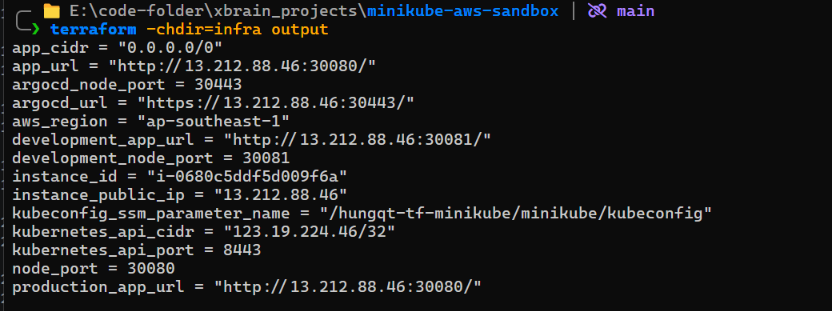

*Hình 02: Terraform output thể hiện public IP, các URL, NodePort, Kubernetes API port và SSM parameter chứa kubeconfig.*

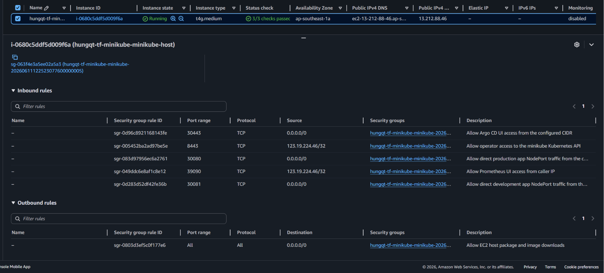

*Hình 03: Security group của EC2 minikube host cho phép các cổng phục vụ lab: `8443`, `30080`, `30081`, `30443`, `39090`.*

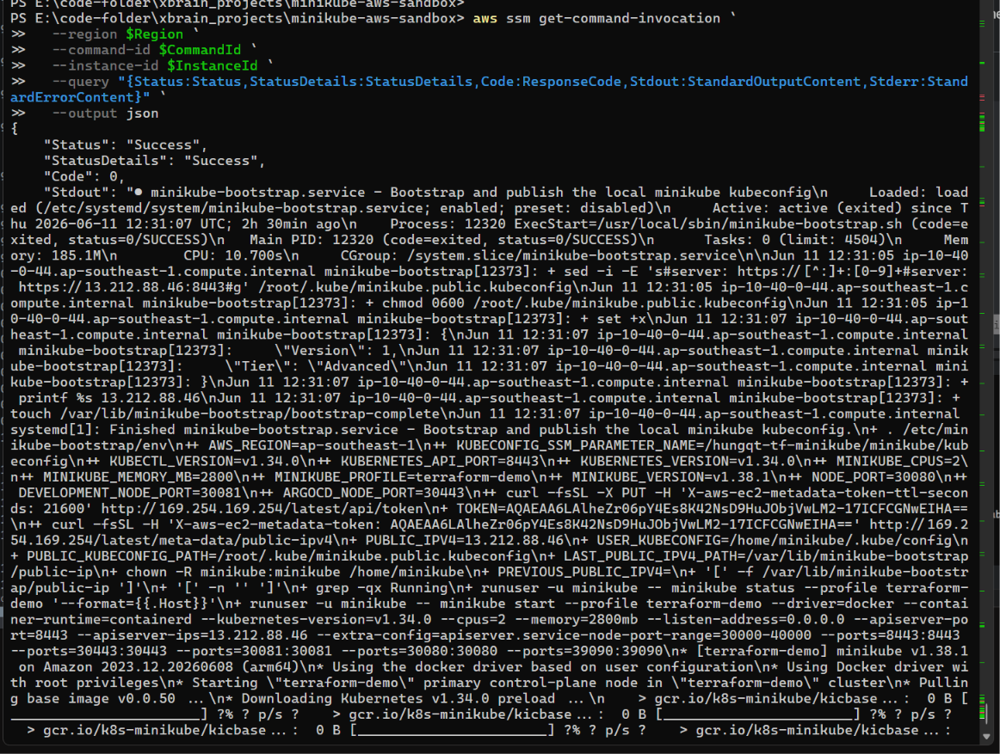

*Hình 04: Log `minikube-bootstrap.service` cho thấy Docker/minikube đã khởi động và kubeconfig đã được publish lên SSM.*

### 2.2. Ngữ cảnh GitOps trong `argocd/`

Phần `argocd/` là lớp delivery của ứng dụng. Đây là nơi Argo CD được cài đặt và cũng là nơi chứa toàn bộ manifest ứng dụng mà Argo CD đồng bộ.

| File / thư mục | Vai trò trong bài lab |
|---|---|
| `argocd/install.ps1` | Cài Argo CD bằng `kubectl apply -k`, đợi CRD và deployment sẵn sàng, sau đó apply `ApplicationSet`. |
| `argocd/install/kustomization.yaml` | Cài Argo CD v3.4.3 từ manifest upstream, namespace, NodePort service và secret repository. |
| `argocd/install/argocd-server-nodeport.yaml` | Expose Argo CD server bằng NodePort `30443`. |
| `argocd/install/github-private-repo-secret.yaml` | Khai báo repository credential cho Argo CD; khi chụp minh chứng phải che token/password. |
| `argocd/bootstrap/apps-applicationset.yaml` | Tạo `AppProject` `sandbox` và `ApplicationSet` `sandbox-apps`. |
| `argocd/apps/frontend` | Frontend Nginx, Service, NodePort overlay, Argo Rollouts canary. |
| `argocd/apps/backend` | Backend Go API, Service, Argo Rollouts canary và `AnalysisTemplate` đọc Prometheus. |
| `argocd/apps/database` | Redis `StatefulSet` và `ClusterIP Service`. |
| `argocd/apps/prometheus` | Helm wrapper cài Prometheus, scrape config, alerting rule và Alertmanager. |
| `argocd/apps/argo-rollout` | Helm wrapper cài Argo Rollouts controller. |

Điểm quan trọng của `ApplicationSet` hiện tại:

```yaml
directories:
  - path: argocd/apps/*/overlays/production
```

Vì vậy, production là môi trường được Argo CD tự phát hiện và sync mặc định. Các overlay development vẫn có trong repository, và hạ tầng cũng mở NodePort `30081`, nhưng muốn development được Argo CD tự sync thì cần mở rộng generator hoặc apply Application riêng cho development.

Lệnh kiểm tra GitOps:

```powershell
kubectl --kubeconfig generated\kubeconfig.yaml -n argocd get appproject sandbox
kubectl --kubeconfig generated\kubeconfig.yaml -n argocd get applicationset sandbox-apps
kubectl --kubeconfig generated\kubeconfig.yaml -n argocd get applications
```

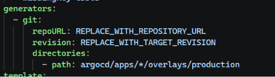

*Hình 06: `ApplicationSet` `sandbox-apps` quét `argocd/apps/*/overlays/production` và tạo các application production.*

Các lệnh triển khai và kiểm tra hạ tầng:

```powershell
.\scripts\deploy.ps1

kubectl --kubeconfig generated\kubeconfig.yaml get nodes -o wide
terraform -chdir=infra output -raw production_app_url
terraform -chdir=infra output -raw development_app_url
terraform -chdir=infra output -raw argocd_url
```


*Hình 01: Script `deploy.ps1` hoàn tất, Kubernetes API sẵn sàng, đồng thời in ra URL của development app, production app và Argo CD.*

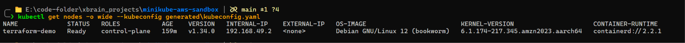

*Hình 02: Lệnh `kubectl get nodes -o wide` cho thấy node minikube ở trạng thái `Ready`.*

## 3. Phần I - Lab buổi sáng: GitOps và CI/CD

### 3.1. Lab 0 - Dựng cụm và chuẩn bị repository

Mục tiêu của lab là có một Kubernetes cluster sẵn sàng để Argo CD quản lý và có Git repository chứa toàn bộ manifest.

Trong repository này, cụm được tạo bằng Terraform và script PowerShell:

```powershell
.\scripts\deploy.ps1
```

Script thực hiện các việc chính:

- Chạy `terraform -chdir=infra init`.
- Chạy `terraform -chdir=infra apply -auto-approve`.
- Đợi EC2 bootstrap Docker và minikube.
- Đợi kubeconfig được publish lên SSM SecureString.
- Tải kubeconfig về `generated/kubeconfig.yaml`.
- Kiểm tra Kubernetes API đã truy cập được.

Kiểm tra sau khi hoàn thành:

```powershell
kubectl --kubeconfig generated\kubeconfig.yaml get nodes
kubectl --kubeconfig generated\kubeconfig.yaml get ns
```

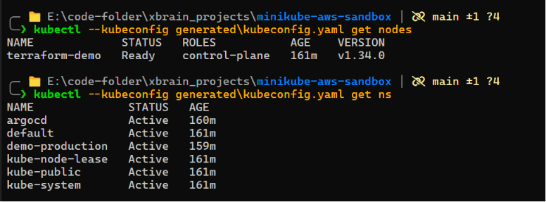

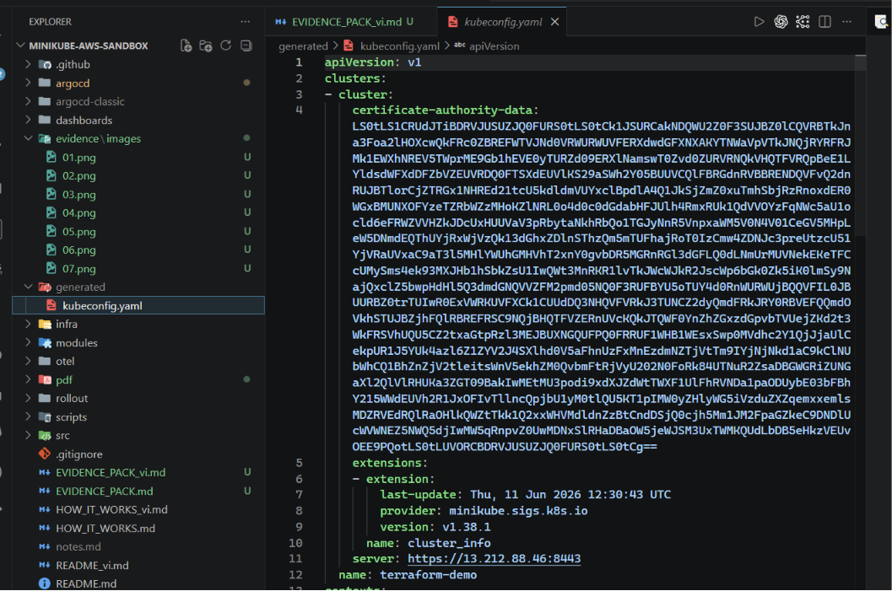

*Hình 08: Kubeconfig trong `generated/kubeconfig.yaml` truy cập được Kubernetes API và liệt kê namespace thành công.*

### 3.2. Lab 1 - Cài đặt Argo CD

Argo CD được cài bằng script:

```powershell
.\argocd\install.ps1 `
  -RepoUrl "https://github.com/<org>/<repo>.git" `
  -TargetRevision "main"
```

Script này cài Argo CD vào namespace `argocd`, expose Argo CD server bằng NodePort `30443`, sau đó apply bootstrap manifest tại `argocd/bootstrap/apps-applicationset.yaml`.

Kiểm tra:

```powershell
kubectl --kubeconfig generated\kubeconfig.yaml -n argocd get pods
kubectl --kubeconfig generated\kubeconfig.yaml -n argocd get svc
terraform -chdir=infra output -raw argocd_url
```

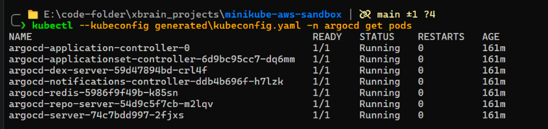

*Hình 09: Các pod của Argo CD trong namespace `argocd` ở trạng thái `Running`.*

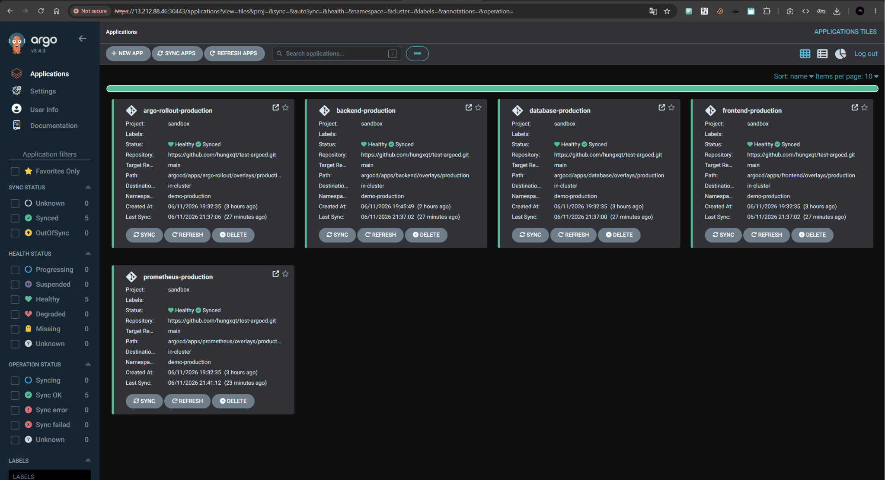

*Hình 10: Giao diện Argo CD UI truy cập được qua URL từ Terraform output.*

### 3.3. Lab 2 - Tạo Application và đồng bộ từ Git

Thay vì apply thủ công từng `Application`, repository dùng `ApplicationSet` để tự phát hiện các overlay production:

```yaml
directories:
  - path: argocd/apps/*/overlays/production
```

Các ứng dụng được đồng bộ từ Git:

- `frontend-production`
- `backend-production`
- `database-production`
- `prometheus-production`
- `argo-rollout-production`

Kiểm tra:

```powershell
kubectl --kubeconfig generated\kubeconfig.yaml -n argocd get applications
kubectl --kubeconfig generated\kubeconfig.yaml -n demo-production get pods,svc,rollouts
```

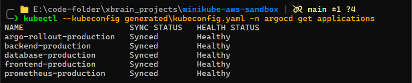

*Hình 11: Các `Application` do `ApplicationSet` tạo ra đều ở trạng thái `Synced` và `Healthy`.*

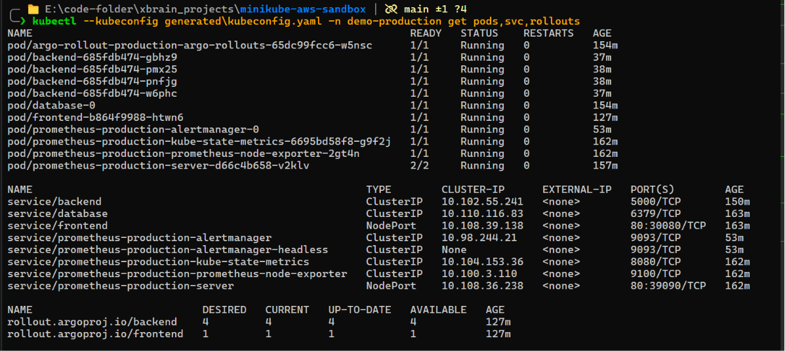

*Hình 12: Namespace `demo-production` có frontend, backend, database và các service cần thiết.*

### 3.4. Lab 3 - Sync tự động và Self-Heal

Nguyên tắc GitOps đã kiểm chứng:

- Trạng thái mong muốn nằm trong Git.
- Argo CD chạy reconciliation loop để so sánh Git với trạng thái cụm thật.
- Nếu có drift do can thiệp trực tiếp bằng `kubectl`, Argo CD tự sửa về đúng trạng thái khai báo.

Kịch bản kiểm tra self-heal:

```powershell
# Cố ý tạo drift bằng cách scale backend lệch khỏi Git.
kubectl --kubeconfig generated\kubeconfig.yaml `
  -n demo-production scale rollout/backend --replicas=20

# Theo dõi Argo CD / Kubernetes kéo replica về giá trị trong Git.
kubectl --kubeconfig generated\kubeconfig.yaml `
  -n demo-production get rollout backend -w
```

Trong overlay production, backend được patch về `replicas: 4`, nên sau khi Argo CD self-heal, số replica mong muốn phải quay về `4`.

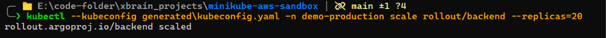

*Hình 13: Backend bị scale lệch khỏi trạng thái trong Git để tạo drift.*

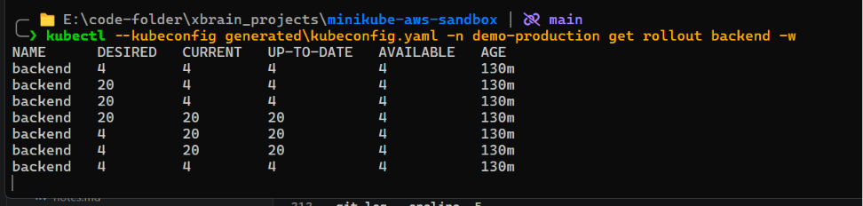

*Hình 14: Argo CD tự đưa backend về trạng thái mong muốn trong Git.*

### 3.5. Lab 4 - Rollback bằng Git Revert

Rollback trong GitOps phải sửa nguồn sự thật, không sửa trực tiếp cụm.

Quy trình rollback:

```powershell
git log --oneline -5
git revert HEAD --no-edit
git push origin main

kubectl --kubeconfig generated\kubeconfig.yaml -n argocd get applications
kubectl --kubeconfig generated\kubeconfig.yaml -n demo-production get pods,rollouts
```

Kết quả mong đợi:

- Git có commit revert rõ ràng.
- Argo CD nhận commit mới và sync lại cụm.
- Ứng dụng quay về trạng thái ổn định trong thời gian dưới 5 phút.

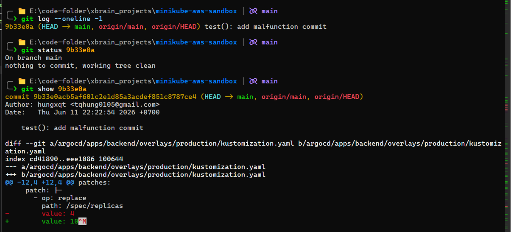

*Hình 15: Lịch sử Git có commit revert dùng để rollback.*

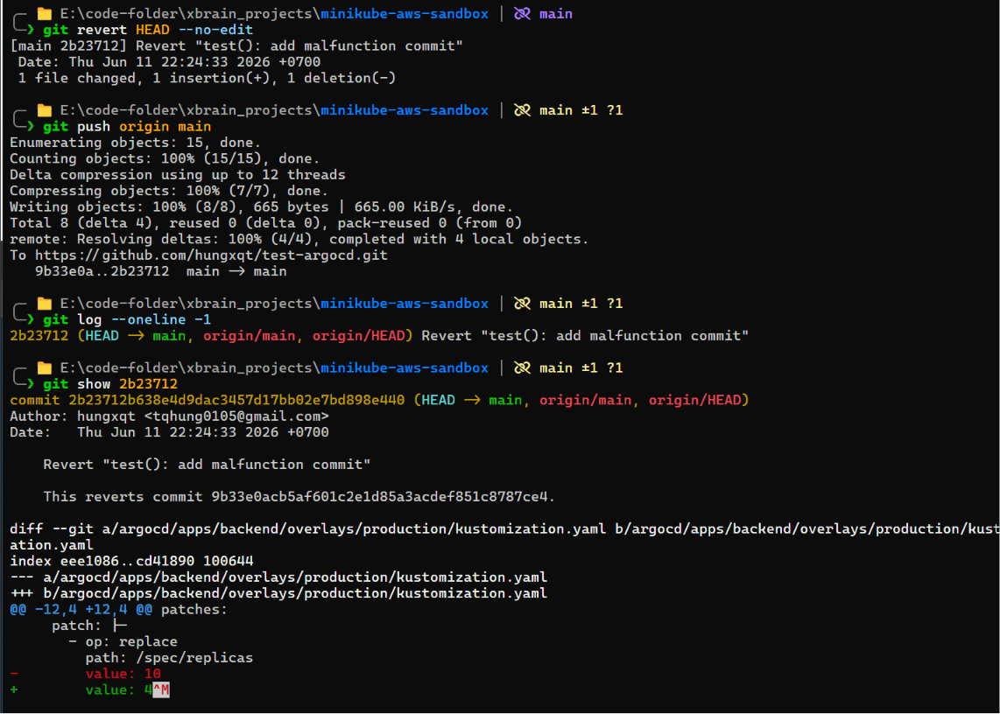

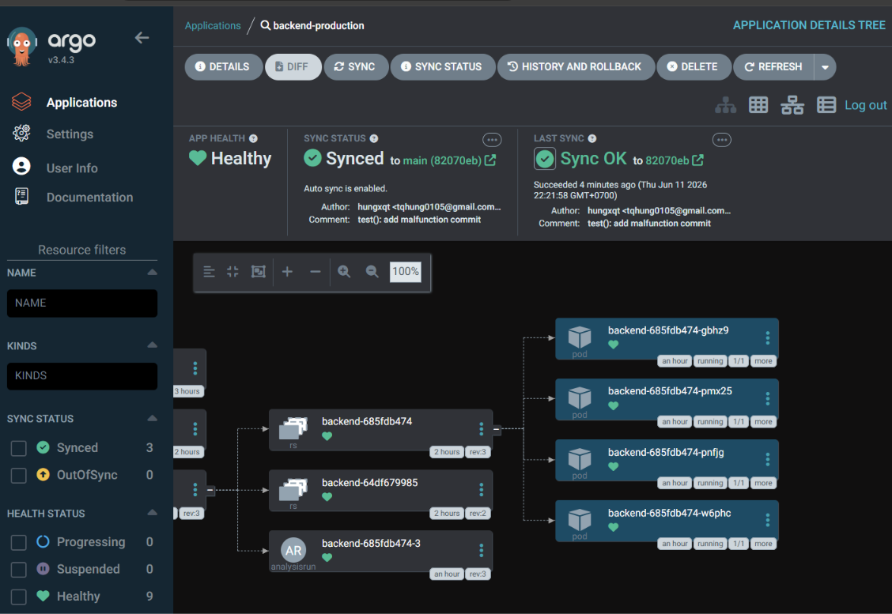

*Hình 16: Argo CD đồng bộ commit revert và ứng dụng trở lại `Synced` / `Healthy`.*

### 3.6. Lab 5 - Mô hình App-of-Apps bằng ApplicationSet

Lab yêu cầu quản lý nhiều ứng dụng qua một root controller. Trong repository này, vai trò đó được triển khai bằng `ApplicationSet`:

- `AppProject` tên `sandbox` giới hạn project, namespace đích và cluster resource được phép tạo.
- `ApplicationSet` tên `sandbox-apps` quét thư mục `argocd/apps/*/overlays/production`.
- Khi thêm app mới vào đúng cấu trúc thư mục và push lên Git, Argo CD tự tạo `Application` mới.

Kiểm tra:

```powershell
kubectl --kubeconfig generated\kubeconfig.yaml -n argocd get appproject sandbox -o yaml
kubectl --kubeconfig generated\kubeconfig.yaml -n argocd get applicationset sandbox-apps -o yaml
kubectl --kubeconfig generated\kubeconfig.yaml -n argocd get applications
```

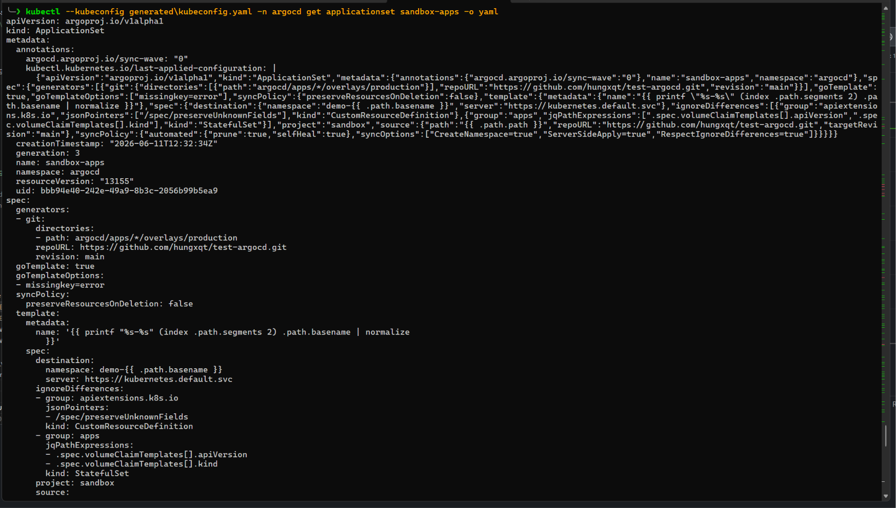

*Hình 17: `ApplicationSet` tạo và quản lý nhiều Argo CD `Application` từ cấu trúc Git.*

### 3.7. Lab 6 - Sync Waves và thứ tự triển khai

Bootstrap Argo CD dùng sync wave để đảm bảo thứ tự hợp lý:

- `AppProject` có annotation `argocd.argoproj.io/sync-wave: "-1"`.
- `ApplicationSet` có annotation `argocd.argoproj.io/sync-wave: "0"`.

Điều này đảm bảo project `sandbox` tồn tại trước khi `ApplicationSet` tạo các `Application` thuộc project đó.

Các `Application` cũng dùng sync options:

- `CreateNamespace=true`
- `ServerSideApply=true`
- `RespectIgnoreDifferences=true`

Kiểm tra:

```powershell
kubectl --kubeconfig generated\kubeconfig.yaml -n argocd get appproject sandbox -o yaml
kubectl --kubeconfig generated\kubeconfig.yaml -n argocd get applicationset sandbox-apps -o yaml
```

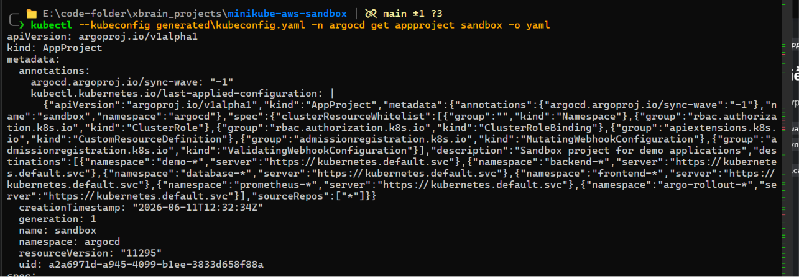

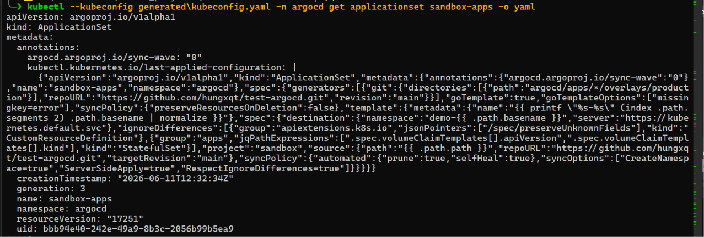

*Hình 18: Annotation sync wave chứng minh bootstrap được triển khai theo thứ tự đúng.*

### 3.8. Lab 7 - CI kiểm tra manifest

Repository có GitHub Actions workflow tại `.github/workflows/manifests-validation.yaml`.

Workflow chạy khi push hoặc pull request thay đổi file YAML trong:

- `argocd/**/*.yaml`
- `argocd/**/*.yml`
- `argocd-classic/**/*.yaml`
- `argocd-classic/**/*.yml`

Job `Validate Manifests Syntax` chạy:

```bash
find . -name "kustomization.yaml" -not -path "*/.terraform/*" | while read -r file; do
  dir=$(dirname "$file")
  kubectl kustomize "$dir" > /dev/null
done
```

Kết quả mong đợi:

- Pull request có manifest sai cú pháp sẽ fail.
- Pull request chỉ được merge khi validation pass.
- Git vẫn là nơi kiểm soát thay đổi trước khi Argo CD sync.

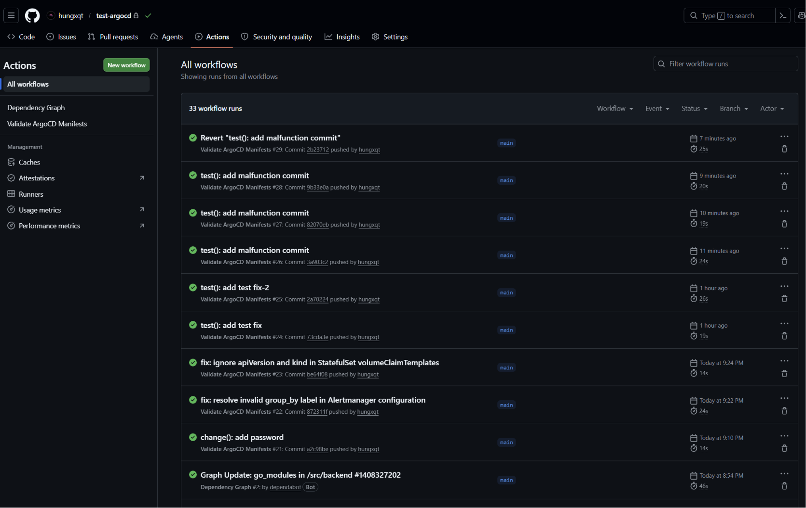

*Hình 19: Workflow `Validate ArgoCD Manifests` chạy thành công trên GitHub Actions.*

## 4. Phần II - Lab buổi chiều: Observability và Canary

### 4.1. Lab 1 - Cài Prometheus và Argo Rollouts qua GitOps

Prometheus và Argo Rollouts được quản lý như các app bình thường trong Git:

- `argocd/apps/prometheus/overlays/production`
- `argocd/apps/argo-rollout/overlays/production`

Khi `ApplicationSet` sync, hai thành phần này được cài vào cụm.

Kiểm tra:

```powershell
kubectl --kubeconfig generated\kubeconfig.yaml -n argocd get applications
kubectl --kubeconfig generated\kubeconfig.yaml -n demo-production get pods
kubectl --kubeconfig generated\kubeconfig.yaml -n demo-production get svc prometheus-production-server
```

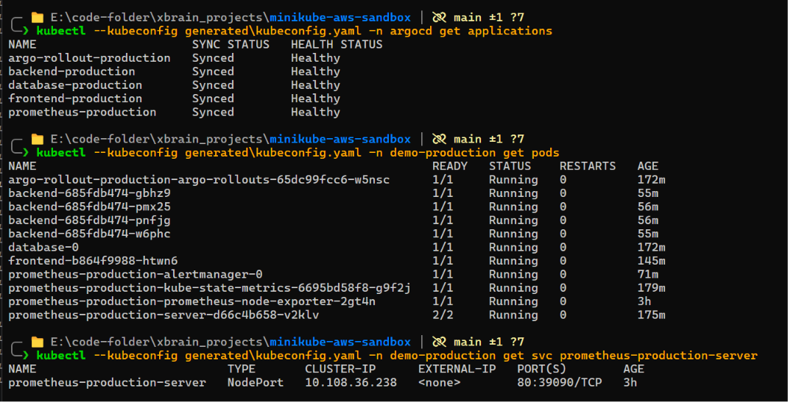

*Hình 20: Prometheus production được expose bằng NodePort `39090`*

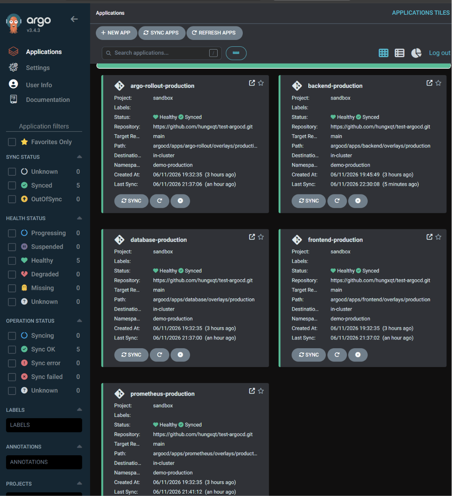

*Hình 21: Argo CD hiển thị Prometheus và Argo Rollouts đã được sync thành công.*

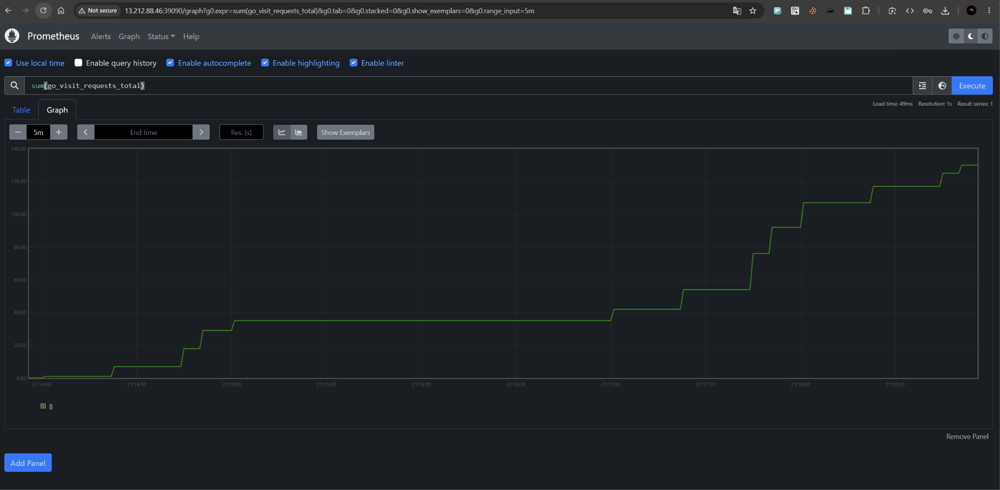

*Hình 22: Prometheus UI truy cập được qua NodePort `39090`.*

### 4.2. Lab 2 - Backend xuất bản custom metrics

Backend Go expose các endpoint:

- `POST /api/v1/visit` - ghi nhận lượt truy cập theo user vào Redis.
- `GET /api/v1/metrics` - xuất Prometheus metrics.
- `GET /healthz` - health check.

Metric chính:

```text
go_visit_requests_total{status="200"}
go_visit_requests_total{status="400"}
go_visit_requests_total{status="401"}
go_visit_requests_total{status="500"}
go_visit_users_active_total
```

Gửi request để tạo dữ liệu:

```powershell
$AppUrl = terraform -chdir=infra output -raw production_app_url
$Body = @{ username = "demo-user"; password = "demo-pass" } | ConvertTo-Json

Invoke-RestMethod `
  -Method Post `
  -Uri "$($AppUrl.TrimEnd('/'))/api/v1/visit" `
  -Body $Body `
  -ContentType "application/json"
```

Kiểm tra metrics:

```powershell
Invoke-WebRequest "$($AppUrl.TrimEnd('/'))/api/v1/metrics"
```

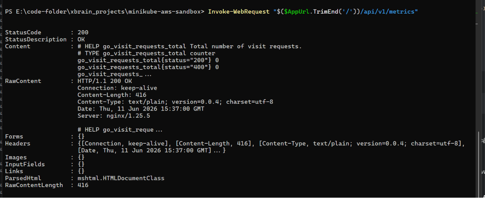

*Hình 23: API `/api/v1/visit` trả về response thành công và tăng số lượt truy cập.*

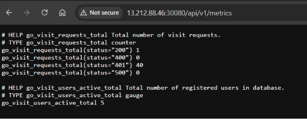

*Hình 24: Endpoint `/api/v1/metrics` hiển thị metric `go_visit_requests_total` và `go_visit_users_active_total`.*

### 4.3. Lab 3 - Prometheus scrape metrics và truy vấn SLI

Prometheus production scrape backend bằng `extraScrapeConfigs`:

```yaml
job_name: 'backend'
metrics_path: '/api/v1/metrics'
static_configs:
  - targets:
      - 'backend.demo-development.svc.cluster.local:5000'
      - 'backend.demo-production.svc.cluster.local:5000'
```

Trong bằng chứng chính, cần chứng minh target `backend.demo-production.svc.cluster.local:5000` ở trạng thái `UP`. Target development có thể `DOWN` nếu bạn chưa sync overlay development, vì `ApplicationSet` hiện tại chỉ tự phát hiện đường dẫn production.

Các PromQL dùng để kiểm tra:

```promql
go_visit_requests_total
```

```promql
sum(rate(go_visit_requests_total{status="200"}[5m]))
/
sum(rate(go_visit_requests_total[5m]))
```

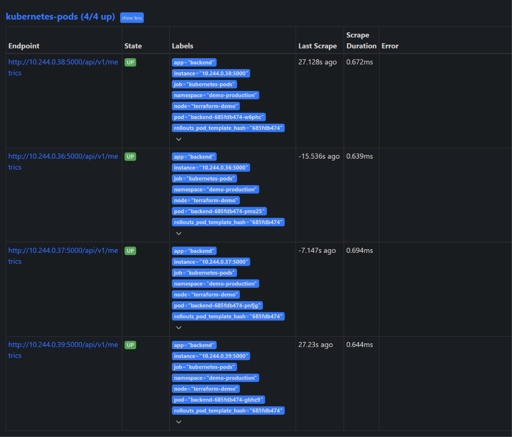

*Hình 25: Prometheus Targets hiển thị backend production scrape target ở trạng thái `UP`.*

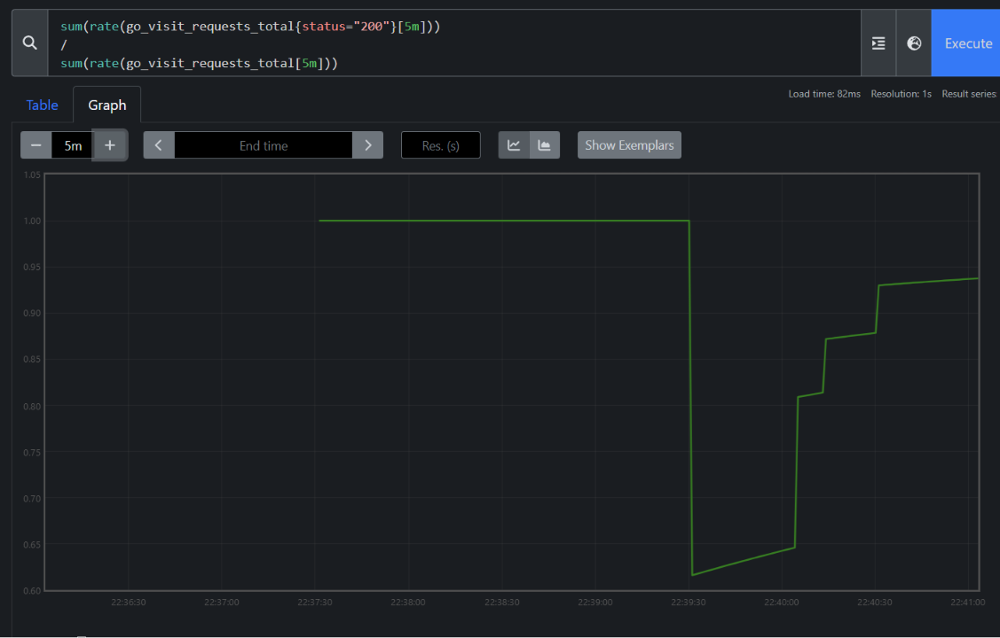

*Hình 26: Prometheus query hiển thị success rate của backend dựa trên metric `go_visit_requests_total`.*

### 4.4. Lab 4 - Canary rollout thủ công

Frontend dùng Argo Rollouts với chiến lược canary:

```yaml
steps:
  - setWeight: 25
  - pause: { duration: 1s }
  - setWeight: 50
  - pause: {}
  - setWeight: 100
```

Ý nghĩa:

- Bản mới được đưa ra 25%.
- Sau đó tăng lên 50%.
- Tại bước 50%, rollout pause vô hạn để người vận hành kiểm tra.
- Nếu ổn, chạy `promote`; nếu lỗi, chạy `abort`.

Lệnh kiểm tra:

```powershell
kubectl argo rollouts get rollout frontend -n demo-production --watch
kubectl argo rollouts promote frontend -n demo-production
kubectl argo rollouts abort frontend -n demo-production
```

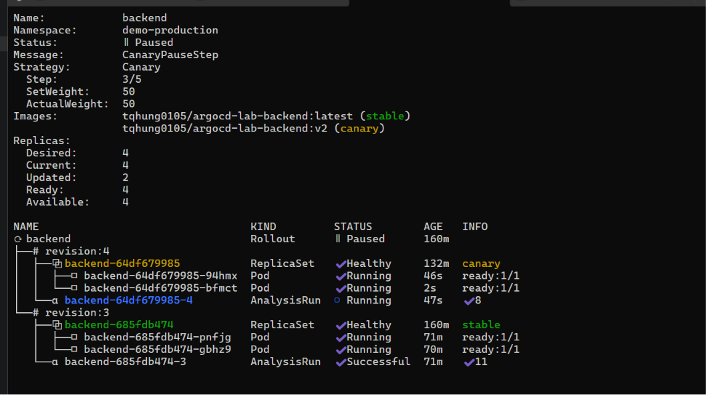

*Hình 27: Argo Rollouts hiển thị backend đang pause tại bước canary để chờ quyết định thủ công.*

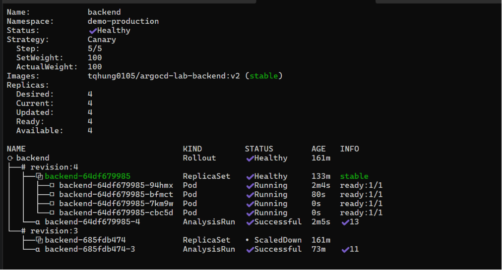

*Hình 28: Sau khi promote, backend canary tiếp tục đến 100% và rollout healthy.*

## 5. Phần III - Dự án cuối khóa: Ship Smartly

Challenge yêu cầu kết hợp đủ ba phần:

1. Thay đổi qua Git và Argo CD sync.
2. Có SLO và alert gửi về email khi chất lượng tụt.
3. Canary bản lỗi tự abort dựa trên Prometheus metric.

### 5.1. Minh chứng GitOps reproducible

Toàn bộ tài nguyên production được mô tả trong Git:

- Frontend: `argocd/apps/frontend/overlays/production`
- Backend: `argocd/apps/backend/overlays/production`
- Database: `argocd/apps/database/overlays/production`
- Prometheus: `argocd/apps/prometheus/overlays/production`
- Argo Rollouts: `argocd/apps/argo-rollout/overlays/production`

Kiểm tra:

```powershell
kubectl --kubeconfig generated\kubeconfig.yaml -n argocd get applications
kubectl --kubeconfig generated\kubeconfig.yaml -n demo-production get all
```

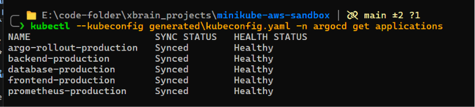

*Hình 29: Production stack được Argo CD quản lý và có thể tái tạo từ Git.*

### 5.2. Minh chứng SLO và email alert

SLO của backend:

```text
Tỷ lệ request thành công HTTP 200 phải >= 95%.
```

Prometheus alert rule:

```promql
(sum(rate(go_visit_requests_total{status="200"}[5m])) or vector(1))
/
(sum(rate(go_visit_requests_total[5m])) or vector(1)) < 0.95
```

Alert:

- Tên: `BackendSuccessRateSLOViolation`
- Ngưỡng: success rate thấp hơn `0.95`
- Thời gian giữ điều kiện: `for: 1m`
- Mức độ: `critical`
- Receiver: email cá nhân qua Alertmanager SMTP

Kịch bản tạo lỗi để alert fire:

```powershell
$AppUrl = terraform -chdir=infra output -raw production_app_url

# Tạo user hợp lệ trước.
$GoodBody = @{ username = "slo-demo"; password = "correct-pass" } | ConvertTo-Json
Invoke-RestMethod `
  -Method Post `
  -Uri "$($AppUrl.TrimEnd('/'))/api/v1/visit" `
  -Body $GoodBody `
  -ContentType "application/json"

# Gửi nhiều request sai mật khẩu để tạo HTTP 401 và kéo success rate xuống dưới SLO.
$BadBody = @{ username = "slo-demo"; password = "wrong-pass" } | ConvertTo-Json
1..200 | ForEach-Object {
  try {
    Invoke-RestMethod `
      -Method Post `
      -Uri "$($AppUrl.TrimEnd('/'))/api/v1/visit" `
      -Body $BadBody `
      -ContentType "application/json"
  } catch {
    # Bỏ qua exception do HTTP 401 để tiếp tục tạo traffic lỗi.
  }
}
```

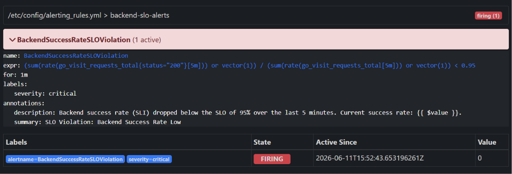

*Hình 30: Prometheus hiển thị alert `BackendSuccessRateSLOViolation` ở trạng thái `FIRING`.*

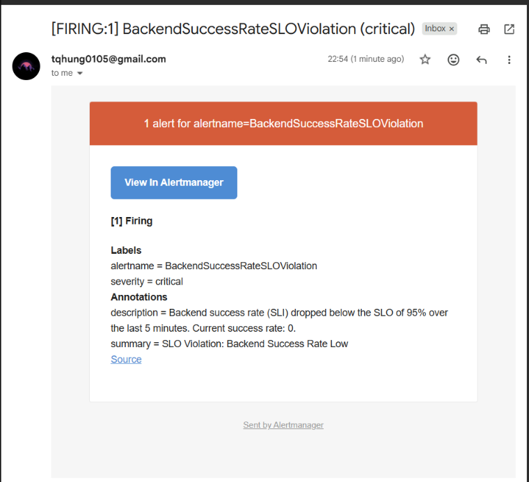

*Hình 31: Email cảnh báo được gửi tới hộp thư cá nhân.*

### 5.3. Minh chứng canary tự động bằng AnalysisTemplate

Backend dùng `AnalysisTemplate` tên `backend-success-rate`.

Cấu hình chính:

```yaml
metrics:
  - name: success-rate
    interval: 10s
    successCondition: result[0] >= 0.95
    failureLimit: 2
    provider:
      prometheus:
        address: http://prometheus-production-server.demo-production.svc.cluster.local:80
```

Query phân tích:

```promql
sum(rate(go_visit_requests_total{status="200"}[1m])) or vector(1)
/
(sum(rate(go_visit_requests_total[1m])) or vector(1))
```

Backend rollout gắn template này trong canary strategy:

```yaml
strategy:
  canary:
    analysis:
      templates:
        - templateName: backend-success-rate
    steps:
      - setWeight: 25
      - pause: { duration: 30s }
      - setWeight: 50
      - pause: { duration: 30s }
      - setWeight: 100
```

Kết quả mong đợi:

- Nếu success rate vẫn >= 95%, rollout tiếp tục tăng dần đến 100%.
- Nếu success rate < 95% trong số lần vượt `failureLimit`, `AnalysisRun` fail.
- Khi `AnalysisRun` fail, rollout chuyển trạng thái không healthy/degraded và bản canary bị dừng.

Lệnh theo dõi:

```powershell
kubectl argo rollouts get rollout backend -n demo-production --watch
kubectl --kubeconfig generated\kubeconfig.yaml -n demo-production get analysisrun
kubectl --kubeconfig generated\kubeconfig.yaml -n demo-production describe analysisrun
```

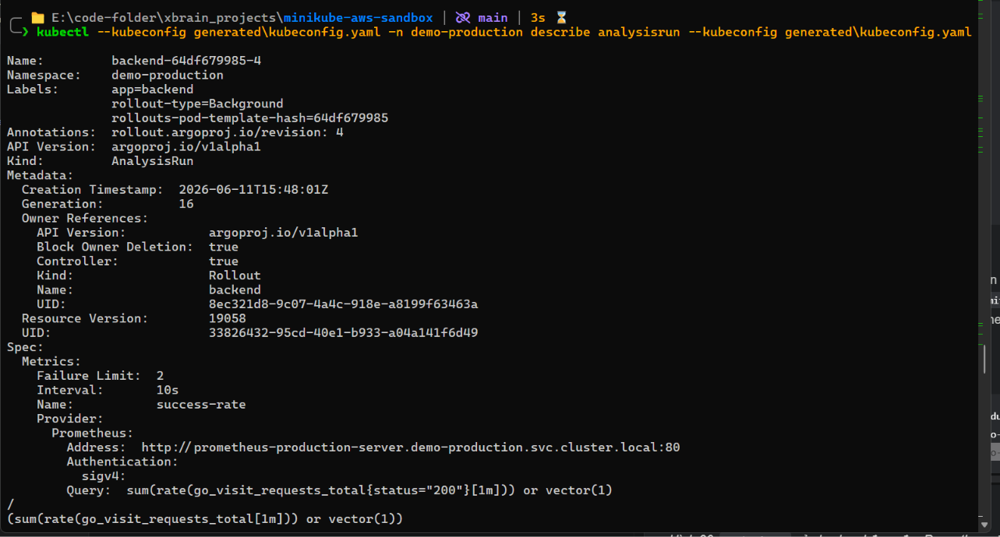

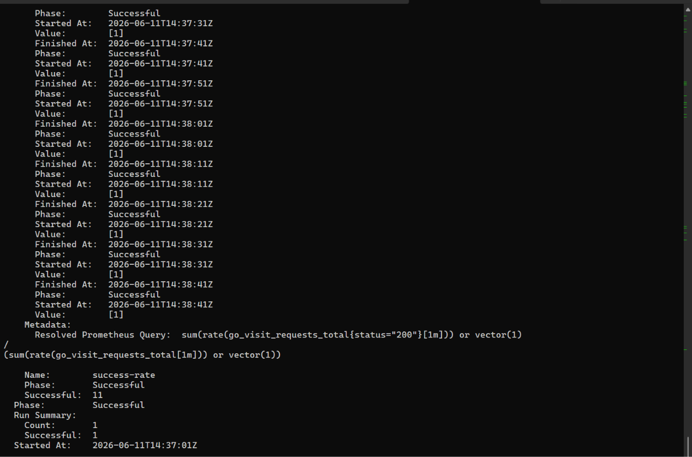

*Hình 32: `AnalysisRun` của backend đang đọc Prometheus để đánh giá success rate.*

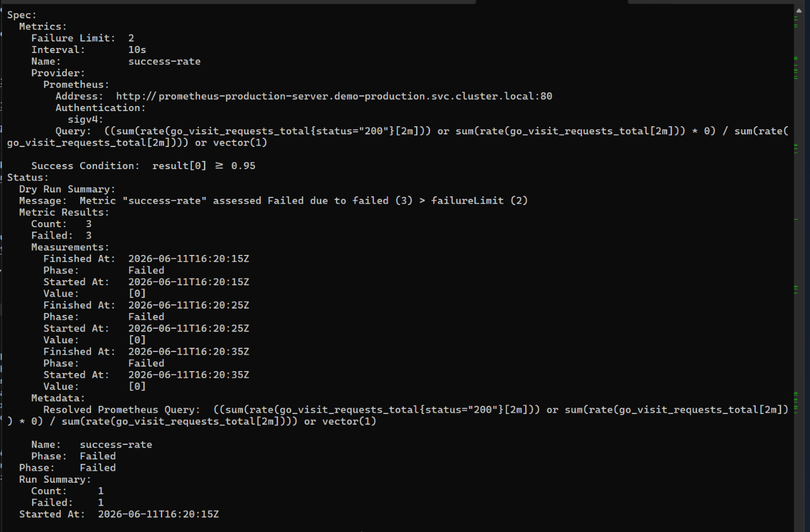

*Hình 33: `AnalysisRun` fail vì metric không đạt điều kiện `result[0] >= 0.95`.*

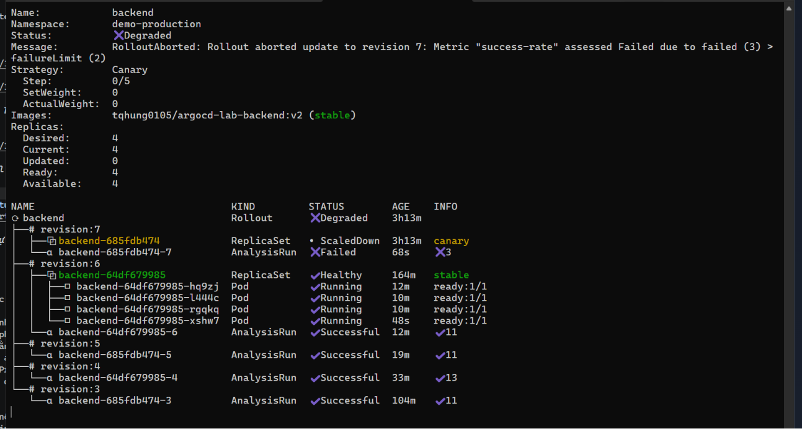

*Hình 34: Backend rollout tự dừng bản canary lỗi và không đưa bản lỗi lên 100%.*

## 6. Kết luận

Các lab và challenge đã được hoàn thành theo đúng tinh thần của Week 9:

- Git là nguồn sự thật duy nhất cho Kubernetes manifests.
- Argo CD tự động đồng bộ, phát hiện drift và self-heal.
- Rollback được thực hiện bằng Git revert, có audit trail rõ ràng.
- Prometheus đo được custom application metrics từ backend.
- SLO được định nghĩa bằng PromQL và có cảnh báo email khi vi phạm.
- Argo Rollouts dùng canary để phát hành dần và dùng `AnalysisTemplate` để tự động chặn bản lỗi.

Evidence pack này là khung nộp bài. Sau khi chèn đủ ảnh vào các placeholder ở trên, tài liệu sẽ chứng minh được cả ba phần: lab buổi sáng, lab buổi chiều và dự án cuối khóa "Ship Smartly".
